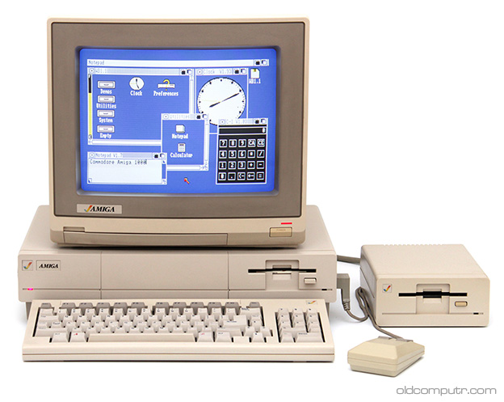

# Markdown Cheat Sheet

## Section A

[Paperhive Cheatsheet](https://paperhive.org/help/markdown)


## Section B

Ispum lorem est

Bullet lists are easy

*   Item 1
*   Item 2
    * Sub Item
*   Item 3


## Section C

Let's link to the website of Grok Learning 
https://groklearning.com/learn/microbit-crash-course/1/4/
This will display the URL in the document.

Let's try a named link to the website of [Golem](https://www.golem.de), which provides lots of useful information.

And now an inline image of an Amiga 1000




## Section D

```python
def fn():
    print("Hello World")
    pass
```
