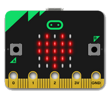

# Embedded Computer

**Willkommen beim Embedded Computer Kurs der KinderUni/EHK.** 

Kaum ein Gerät kommt heute ohne eine elektronische Steuerung aus. Meistens sind dies kleine, eingebaute (Embedded) Computer. In einem Auto sind gegen Hundert solche Embedded Computer vorhanden. Im Gegensatz zu den grossen PC sind diese viel kleiner und haben keinen Bildschirm und keine Tastatur. Dafür können sie Bewegungen feststellen, einen Taster abfragen oder Licht erkennen.

In diesem Kurs wollen wir lernen wie ein solcher Computer programmiert werden kann. Dazu verwenden wir einen BBC micro:bit Computer den jeder Teilnehmer anschliessend nach Hause mitnehmen kann. Die Programme entwickeln wir grafisch am Computer (Microsoft Makecode). Vorkenntnisse sind dazu keine notwendig.

Nach einer gemeinsamen Einführung in die Programmierung kann jeder Teilnehmer selber eigene Programme schreiben.

<!--
## Teilnehmer Informationen

Auf den folgenden Seiten finden sich die wichtigsten Informationen für Euch. Bitte lest diese bevor ihr den Kurs besucht. Falls ihr noch Fragen habt, meldet euch bitte beim EHK.

*   [Wegbeschreibung](info_way.md)
*   [Kursmaterial](info_material.md)
-->
  

## Lektionen

Du findest eine Übersicht aller Lektionen dieses Kurses auf der [folgenden Seite](lessons/index.md).

Wenn du von hier direkt zu einer Lektion springen willst kannst du auch das Menü **Lektionen** verwenden.
