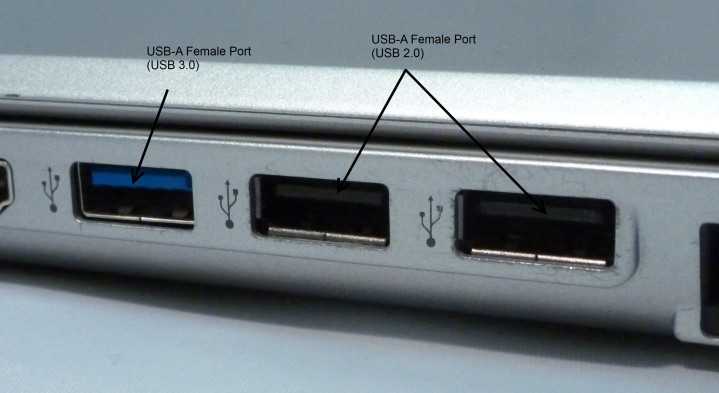
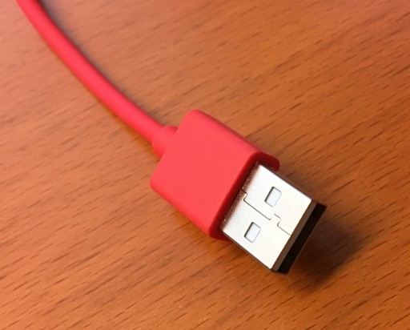

# Kursmaterial

Um die Übungen mit dem micro:bit durchzuführen werden wir die Makecode Webseite nutzen. Dazu benötigen die Kursteilnehmer ein (mehr oder weniger) aktuelles Notebook. Die Programme werden im Browser entwickelt und auf den micro:bit per USB-Kabel übertragen.

## Voraussetzungen

Der/Die Kursteilnehmer(-in) sollte in der Lage sein einen Webbrowser zu bedienen. Die fortgeschrittenen Teilnehmer, welche auch textbasiert in Python programmieren möchten, sollten mit Tastatur schreiben können.

## Notebook

An den Notebook werden keine speziellen Anforderungen gestellt. Jedes einigermassen aktuelle Model sollte funktionieren. Wer will kann sein Notebook vor dem Kurs auf der Makecode [Website](https://makecode.microbit.org/#editor) ausprobieren.

*   Windows 7, 8, 10 oder MacOS X. Auch Linux ist möglich.
*   Genügend grosser Bildschirm um die Makecode Webseite nutzen zu können (1280x900 oder besser).
*   Wi-Fi für Internetzugang (Verbindung über das Public WLAN von NetModule).
*   Webbrowser, wir arbeiten mit Chrome oder Firefox.
*   USB Typ A Anschluss (siehe Bild unten). Entweder USB 2.0 oder 3.0. Achtung: Die neuen USB Typ C Anschlüsse funktionieren nicht ohne weiteres. Hierfür wird ein kleines Adapterkabel (z.B. [dieses](https://www.apple.com/ch-de/shop/product/MJ1M2ZM/A/usb%E2%80%91c-auf-usb-adapter)) benötigt. Dies betrifft allem neuere Apple Macbooks, welche keinen Anschluss des Typs A mehr zu Verfügung stellen.
*   Falls gewünscht Maus, die Bedienung des Browser geht dadurch einfacher.

Bitte das Netzteil nicht vergessen, damit euch nicht der Strom ausgeht!

|  |
| :--: | 
|USB Typ A Anschluss|

|  |
| :-: | 
| micro:bit USB Kabel |

## Was, wenn ich keinen Notebook mitbringen kann

Kein Problem. Wenn nicht genügend Notebooks zur Verfügung stehen, werden wir Zweiergruppen bilden, die gemeinsam mit einem Rechner arbeiten.

