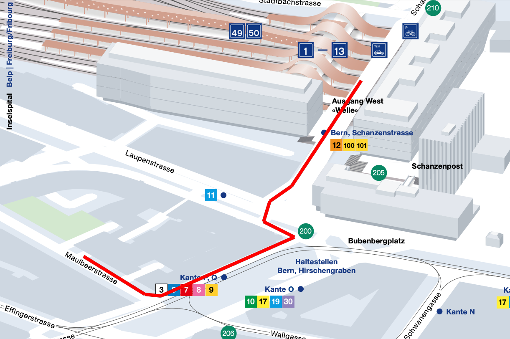

# Kursort

Der Embedded Computer Kurs findet im Sitzungszimmer der Firma **NetModule AG** in Bern statt. 

NetModule AG  
Maulbeerstrasse 10  
3011 Bern  

Landeskoordinaten: 599847, 199502 ([search.ch](https://map.search.ch/Bern,Maulbeerstr.10@599847,199502))  
GPS Länge: 7.436623935, Breite: 46.946603779  

## Anfahrt mit ÖV

Die Büros der NetModule sind vom Bahnhof Bern problemlos in 5 Minuten zu Fuss zu erreichen.

*   Mit dem Zug (SBB, BLS) zum Hauptbahnhof Bern.
*   Den Bahnhof über den Ausgang West "Welle" verlassen. Nicht die Unterführung benutzen. [Link zum SBB Plan](https://plans.trafimage.ch/bern?lang=de&layer=bern_aussenplan&x=600037.39&y=199666.3&z=18).
*   Der Schanzenstrasse nach unten folgen bis zum Lichtsignal.
*   Auf die andere Strassenseite der Laupenstrasse wechseln (3x Lichtsignal).
*   Links halten und anschliessend rechts dem Hirschengraben entlang laufen.
*   Bei der nächsten Strasse nach rechts in die Maulbeerstrasse gehen (beim Restaurant National).
*   Nach etwa 100m steht ihr vor dem Eingang des Bürogebäudes 10.
*   Das Areal ist am Wochenende geschlossen. Wir holen euch vor der Eingang ab.

## Anfahrt mit PKW

Die Parksituation in Bern ist nicht optimal. Wir empfehlen ein Parkhaus in der Nähe des Bahnhofs (Achtung teuer).

*   Bahnhofparking
*   City West

Zum Ein-/Aussteigenlassen kann an der Maulbeerstrasse angehalten werden. Die Parkplätze entlang der Strasse sind üblicherweise besetzt (oder Privat).

## Büros

Das Areal ist am Wochenende geschlossen. Wir holen auch daher am Eingang Maulbeerstrasse 10 ab 9:45 ab.

Wenn ihr zu früh seid, geniesst ihr am Besten noch einen Kaffee oder eine Schoggi in einem der Restaurants in der Nähe.
