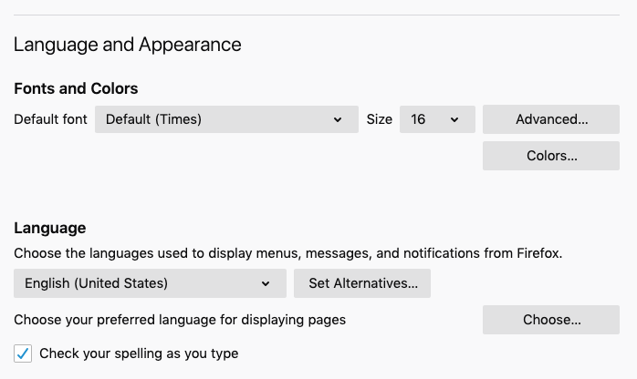
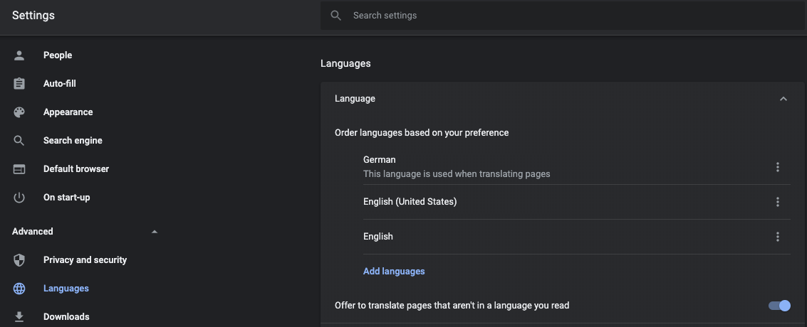
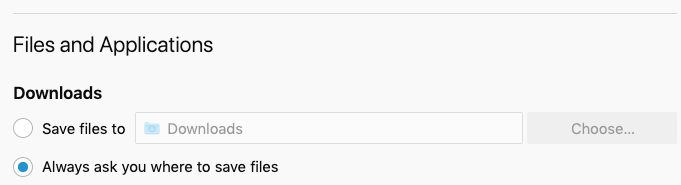
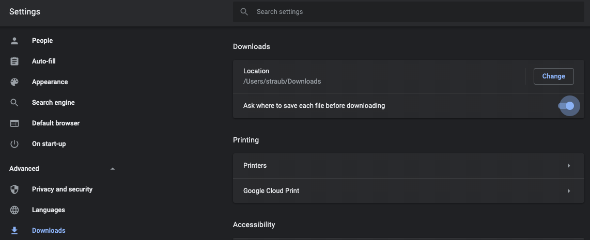

# Einstellung Sprache

## Firefox

*   Einstellungen -> Preferences (about:preferences)

## Chrome

*   Einstellungen -> Advanced -> Languages
*   Gewünschte Sprache anwählen -> Move Up

# Einstellungen für Download

## Firefox

*   Einstellungen -> Preferences (about:preferences)

## Chrome

*   Einstellungen -> Advanced -> Downloads

