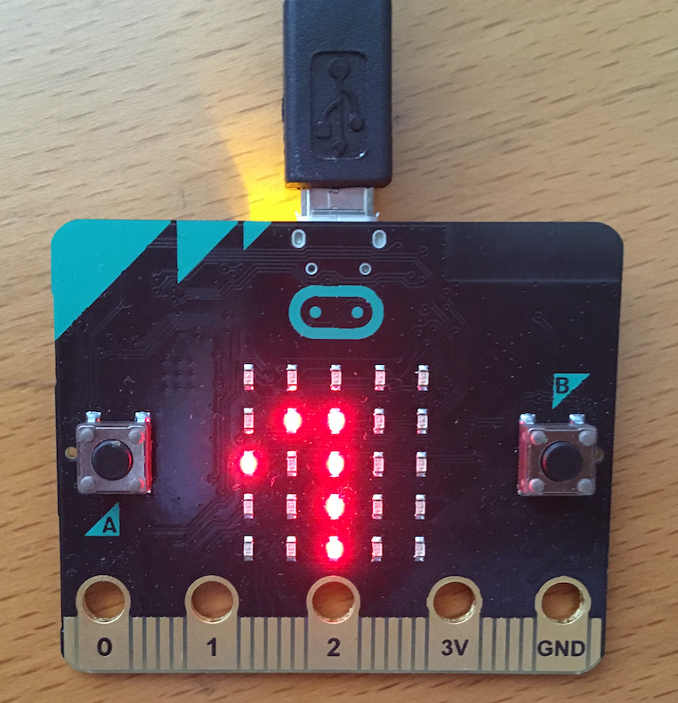

# Hello World

## Einleitung

In diesem Teil erstellen wir unser erstes Program im Block Editor von Makecode. Wir werden das Program erst im Browser starten und prüfen ob alles funktioniert. Anschliessend installieren wir das Programm auf dem micro:bit.

Wenn alles klappt ändern wir das Program so ab dass es deinen Namen anzeigt.

## Verwendete Technologien

*   Makecode Block Editor
*   Block Programmiersprache
*   Simulator und micro:bit Computer

## Programmierung

### Schritt 1: Das Program schreiben

*   Oeffne mit dem Browser die [Makecode Website](https://makecode.microbit.org/). 
*   Vergrössere das Fenster so dass es den ganzen Bildschirm ausfüllt.
*   Klicke **Neues Projekt**.
    *   Falls du die Texte auf English siehst, müssen wir die Sprache in deinem Browser auf Deutsch umstellen [Link](browser_settingss.md).
*   Du bist nun im Editor wo du das Program schreiben kannst. Folgende Teile siehst du:
    * Links: micro:bit Simulator. In diesem werden wir das Program testen.
    * Mitte: Die Blöcke mit welchen zum Programmieren verwendet werden können.
    * Rechts: Der Editor in dem das Program zusammengestellt wird.

Wir wollen den Text "Hello micro:bit" (ein klassiche Computerprogramm zum Testen) auf dem micro:bit anzeigen lassen.

* Wähle das Menü **Grundlagen** mit der Maus.
* Suche den Block **zeige Zeichenfolge** und ziehe ihn in die Mitte des Editors. 
* Schiebe den Block mit der Maus in die Mitte von **beim Start**. Wenn du am richtigen Ort bist, kannst du den Block anschliessen.
* Klicke mit der Maus auf den Text "Hello" und ändere ändern ihn auf "Hallo micro:bit".
* Lösche den Block **dauerhaft**, er wird nicht benötigt.
    * Drücke mit der rechten Maustaste auf den Block.
    * Wähle das Menü **Block löschen**.
* Dein Program sollte nun so aussehen:

### Schritt 2: Ausprobieren im Simulator

Vielleicht hat du es bemerkt. Nachdem du das Program geschrieben hast, wurde es bereits im Simulator (linker Teil des Fensters) ausgeführt. Wir wollen aber nun etwas genauer schauen wie der Simulator benutzt wird.

Unterhalb des micro:bit siehst du eine graue Leiste mit verschiedenen Knöpfen. Mit diesen bedienst du den Simulator. Für den Beginn benötigen wir nur die zwei Knöpfe links:

*   Start/Stop (rot): Stoppt das laufende Program, startet es neu wenn gestoppt.
*   Reset (blau): Startet das Program neu (auch wenn es schön läuft).

Drücke den Reset Knopf und beobachte wie der Text "Hallo micro:bit" über den Bildschirm läuft. Während das Program läuft kannst du es mit dem Start/Stop Knopf anhalten, der Bildschirn wird dann grau um zu zeigen dass der Simulator angehalten ist.

### Schritt 3: Erweiterung des Programmes

Das aktuelle Programm zeigt den Text genau einmal an wenn das Programm gestartet wird, danach bleibt der Bildschirm dunkel. Wir wollen das Programm erweitern, so dass der Text immer wieder angezeigt wird.

*   Wähle aus dem Menu **Schleifen** den Block **während wahr** und platziere ihn im Editor.
*   Verschiebe den Block **zeige Zeichfolge** in den neuen Block hinein.

Wir wollen nach dem Text eine kleine Pause einfügen, bevor er von vorne beginnt.

*   Wähle aus dem Menu **Grundlagen** den Block **pausiere** und platziere ihn im Editor.
*   Hänge den neuen Block unterhalb von **zeige Zeichenfolge** an.
*   Klicke auf die Zahl **100** und ändere sie auf **1 second**.
*   Bewege nun den ganzen Bereich und platziere ihn innerhalb des leeren **beim Start** Blocks.
    * Fasse dazu den Block **während wahr** der wie eine Klammer aussieht mit der Maus.
    * So kannst du alle Blöcke miteinander bewegen.
*   Dein Program sollte nun wie folgt aussehen. Du kannst es wie vorher im Simulator ausprobieren.

### Schritt 4: Download auf den micro:bit

Bisher haben wir das Program nur auf dem Computer ausgeführt. Jetzt wollen wir schauen, ob es auch auf dem micro:bit funktioniert. Dazu müssen wir das Program auf den micro:bit kopieren/herunterladen. Auf Englisch "Download" genannt.

Damit das funktioniert muss der micro:bit mit deinem Computer verbunden sein.

*   Gib dem Programm den Namen "Hello World" in dem Feld unten in der Mitte. Unter diesem Namen wirst du es später auch wieder finden.
*   Wähle **Herunterladen** 
    *   Es sollte sich ein Fenster öffnen, das fragt wohin gespeichert werden soll.
    *   Wähle den Microbit. Dies ist etwas schwierig beim ersten Mal. Wir helfen dir bei diesem Schritt.
    *   **Sollte sich kein Fenster öffnen, müssen wir die Einstellung an deinem Browser ändern** [Link](browser_settingss.md).

*   Während einiger Sekunden überträgt der Computer das Programm nun auf deinen micro:bit. Du siehst das an der gelben Leuchtdiode (LED) neben dem USB Anschluss. Sie blinkt rasch. Wenn der Download beendet ist, leuchter sie wieder dauernd.
*   Wenn alles geklappt hat siehst du nun die Laufschrift auf dem micro:bit

**Gratulation du hast dein erstes Programm geschrieben**. Wie wäre es wenn du das Program so änderst, dass es deinen Namen schreibt?

## Was haben wir gelernt

*   Erstellen und ändern eines neues Programmes im Block Editor.
*   Ausprobieren des Programms im Simulator
*   Herunterladen und starten des Programs auf dem micro:bit

## Programme

*   Schritt 1: [makecode::hello world 1](https://makecode.microbit.org/_dxuFzf6HUVPy)  
*   Schritt 3: [makecode::hello world 2](https://makecode.microbit.org/_2zw1WK4gfHTD)  
