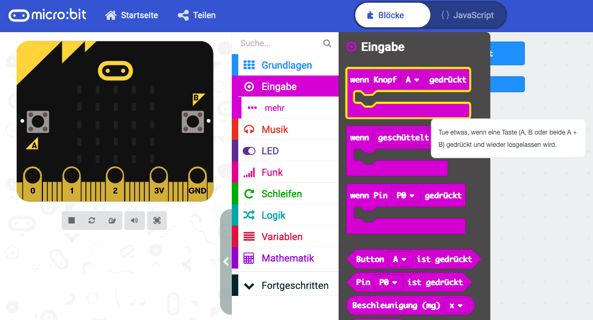
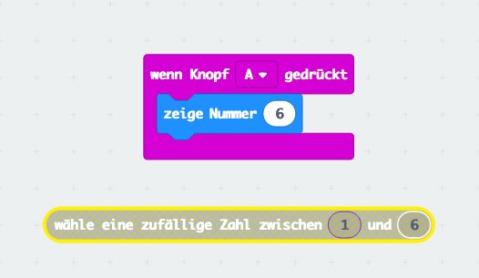
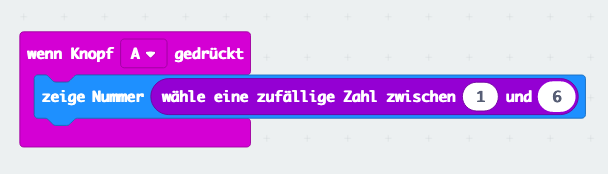
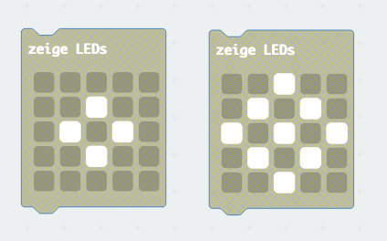
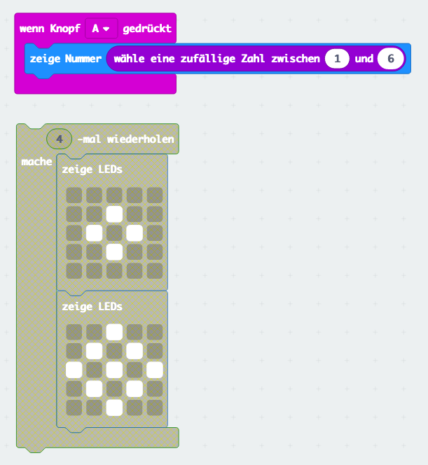
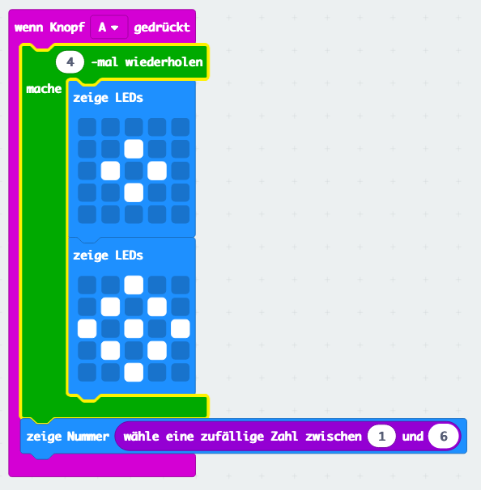
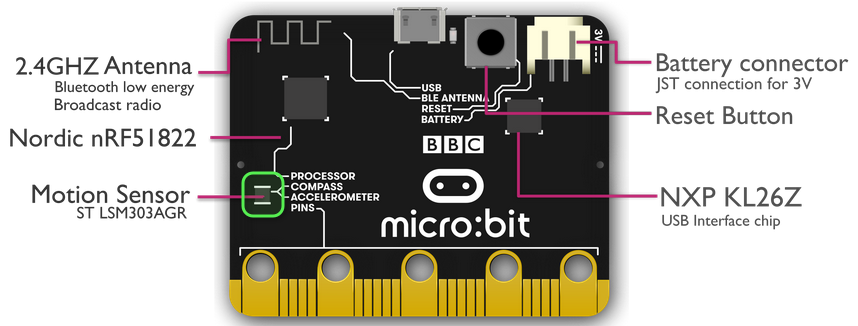
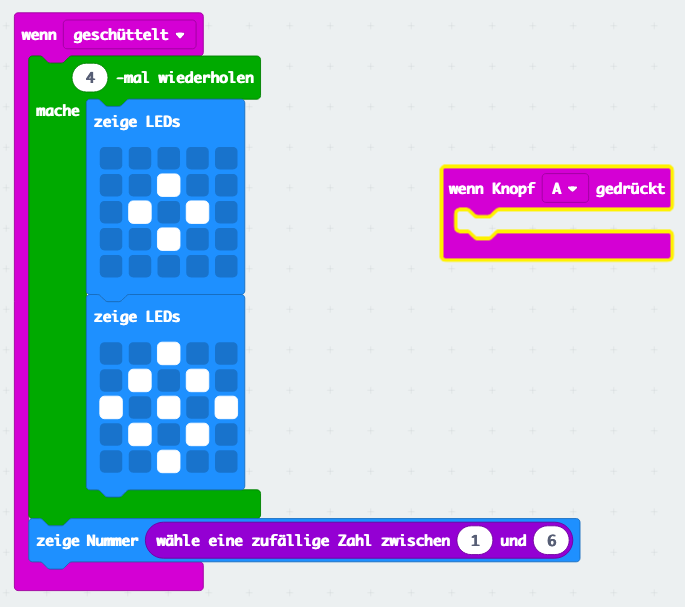
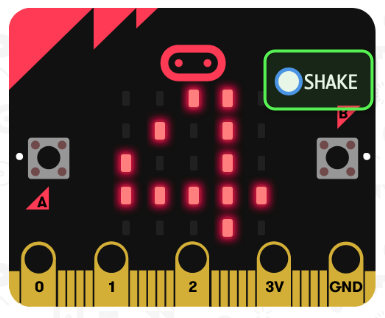

# Elektronischer Wuerfel

## Einleitung

Diese Lektion lernt uns einige neue Programmierblöcke mit welchen wir einen Spielwürfel programmieren. Wie ein Spielwürfel soll der micro:bit eine zufällige Zahl zwischen eins und sechs anzeigen wenn er geschüttelt wird.

## Verwendete (neue) Technologien

*   Auf einen Tastendruck oder Schütteln reagieren (Bewegungssensor abfragen)
*   Block für Wiederholungen (Schleifen)
*   Anzeige von Bildern
*   Zufallszahlen

## Programmierung

### Schritt 1: Eine zufällige Zahl anzeigen

Wir starten mit einem einfachen Programm das eine Zahl zwischen eins und sechs anzeigt, wenn die Taste **A** gedrückt wird. 

*   Oeffne mit dem Browser die [Makecode Website](https://makecode.microbit.org/). 
*   Klicke **Neues Projekt**.
*   Wähle aus dem Menü **Eingabe** den Block **wenn Knopf gedrückt**.

*   Platziere **Grundlagen** -> **zeige Nummer** in den **Knopf** Block.
*   Aendere die Zahl **0** auf **6**.
*   Die beiden Blöcke **beim Start** und **dauerhaft** benötigen wir nicht. Du kannst sie löschen.
    * Mit der rechten Maustaste anklicken und **Block löschen** wählen.

Wie du siehst macht unser Programm nun erst einmal nichts obwohl der Simulator läuft. Warum? Das Programm wartet, dass wir die Taste **A** drücken. Klicke im Simulator mit der Maus auf den Knopf links, das ist der **A** Knopf. Der micro:bit zeigt die Zahl 6 an. 

Obwohl du mit diesem Würfel immer gewinnst, war das nicht unser Ziel. Wir wollen ja eine zufällige Zahl zwischen eins und sechs anzeigen.

*   Wähle aus **Mathematik** den Block **wähle eine zufällige Zahl..**
*   Aendere die beiden Zahlen (0 und 10) so dass ein Spielwürfel mit den Werten 1 bis 6 entsteht.

Nun brauchen wir etwas Fingerspitzengefühl. Wir müssen die feste Zahl **6** im Block **zeige Nummer** mit dem neuen Block ersetzen.

*   Fasse dazu den Block **zufällige Zahl** mit der Maus an bewege ihn genau auf die Zahl **6** bei **zeige Nummer**. Halte die Maustaste dazu gedrückt. 
*   Wenn du den Block _richtig_ anfasst erhält er einen gelben Rahmen.
*   Auch die Zahl **6** erhält einen gelben Rahmen wenn du mit der Maus genau darauf zielst. Dies ist das Zeichen dass du den Block am richtigen Ort hast.
*   Nun nur noch die Maustaste loslassen. 

Dein Programm sollte nun so aussehen. Wenn nicht kannst du einfach nochmal probieren.

Probiere das Programm im Simulator aus. Mit jedem Druck der Taste **A** erscheint nun eine zufällige Zahl zwischen eins und sechs.

### Schritt 2: Die Spannung erhoehen

Auch wenn unser Würfel eigentlich schon funktioniert ist er doch etwas langweilig. Wir wollen nun etwas mehr Spannung in unser Programm bringen. Statt die Zahl sofort anzuzeigen soll der Würfel für eine Zeit lang eine Animation anzeigen und erst dann die Zahl. So wird das ganze gleich viel aufregender.

*   Wähle **Grundlagen** -> **zeige LEDs**
*   Zeichne dir ein Muster in den ersten Block, in dem du die Leuchtdioden (LEDs) mit der Maus anklickst. Mit jedem Klick schaltet du eine LED ein oder wieder aus.
*   Wähle den neuen Block mit der rechten Maustaste an und drücke **Duplizieren**. Du hast nun zwei gleiche Blöcke.
*   Ändere das Muster des zweiten Blocks, so dass sich eine Animation (Bewegung) ergibt.

Wir wollen nun die zwei Bilder für eine Weile anzeigen bevor der Würfel sein Resultat zeigt. Dazu brauchen wir eine Schleife. Eine Schleife wiederholt etwas mehrere Male, so dass wir nicht die Blöcke immer und immer wieder kopieren müssen.

*   Ziehe aus **Schleifen** den Block **4-mal wiederholen** in den Editor.
*   Verschiebe mit der Maus deine Bilder in den Schleifenblock. Dies braucht etwas Übung. Wenn du an der richtigen Stelle ist erscheint im Schleifenblock eine gelbe Markierung und die Klammer wird etwas grösser. Dann kannst du loslassen.

Du hast nun beide Bilder in der Schleife. Warum sind die Schleife und die Bilder **grau** dargestellt, der Rest des Programmes aber farbig? Hast du eine Idee?

Der Grund ist dass der Block mit der Schleife (noch) nirgends verwendet wird. Wenn wir unser Programm starten, wird die Schleife nicht ausgeführt. Wir müssen den Schleifenblock in das bestehende Programm schieben.

*   Wähle den Schleifenblock mit der Maus. Gib acht, dass du nicht die Bilder anklickst.
*   Bewege nun den Block. Wie du siehst werden die Bilder innerhalb der Schleife automatisch mitbewegt.
*   Platziere das ganze direkt unter **wenn Knopf A gedrückt**.
*   Wenn alles richtig ist, sieht dein Programm nun so aus. Die Schleife ist Teil des Programms und hat nun eine Farbe.
*   Probiere dein Programm im Simulator aus.

Wenn dir die Animation mit den zwei Bildern nicht gefällt, ändere sie einfach ab. Du kannst auch weitere Bilder hinzufügen, um kompliziertere Animationen zu erstellen. Am einfachsten über Duplizieren eines vorhandenen Blocks.

### Schritt 3: Schütteln

Wie zu Beginn versprochen soll der Würfel starten, wenn er geschüttelt wird. Dieser Schritt zeigt dir eine Funktion des micro:bit die dein Computer nicht hat. Der micro:bit hat einen winzigen Sensor auf der Rückseite. Dieser Sensor kann messen kann ob er bewegt wird. Ebenso kann der Sensor herausfinden ob dein micro:bit herunterfällt oder wie er liegt (z.B. auf dem Kopf).

Für die Interessierten: Der Sensor kann Kräfte messen. Solange er nicht bewegt wird, _sieht_ er nur die Erdanziehungskraft, die auch uns alle am Boden hält. Diese Kraft zeigt nach unten zur Mitte der Erde. Wenn du den micro:bit umdrehst sieht der Sensor dieselbe Kraft nur in die andere Richtung. So weiss er wie er auf dem Tisch liegt.

Wenn du den micro:bit schüttelst benötigtst du auch Kraft. Diese zusätzliche Kraft misst der micro:bit und kann sie als Schütteln erkennen. Eine weitere spannende Funktion ist dass der Sensor erkennen kann wenn er herunterfällt. In dem Fall misst er keine Beschleunigung (zumindest nicht bis er am Boden aufschlägt). Du kennst das Gefühl vielleicht von der Achterbahn wenn du plötzlich ganz leicht (schwerelos) wirst.

So genug Wissenschafft für den Moment. Wir ändern nun unser Programm ab, dass der Würfel startet wenn er geschüttelt wird.

*   Platziere aus **Eingabe**, den Block **wenn geschüttelt** an einem freien Ort im Editor.
*   Wir wollen nun einen Teil des vorhandenen Programms in den neuen Block verschieben.
*   Greife dazu den Block **4-mal wiederholen** mit der Maus. Wie du siehst wird auch hier wieder der ganze Inhalt der Schleife und der Block **zeige Nummer** beweget. Der Editor ist schlau, er merkt was zusammen gehört.
*   Lege alles zusammen in den Block **wenn geschüttelt**. 
*   Es kann sein dass du nun nicht mehr das ganze Programm auf im Editor siehst, weil es zu weit am Rand ist. 
*   Drücke an einem freien Ort (grauer Hintergrund) die linke Maustaste und bewege den Editor bis du wieder alles siehst. 
*   Um Platz zu schaffen kannst du den Block **wenn Knopf...** löschen, oder woanders hin schieben.

Ein grosses Problem haben wir jetzt noch. Wie starten wir das Programm denn jetzt. Bisher konnten wir im Simulator einfach die Taste **A** drücken, aber jetzt soll der micro:bit ja erkannen dass er geschüttelt wird.

Bitte schüttelt jetzt nicht eure Notebooks. Erstens funktioniert das nicht, zweitens geht er dabei eher kaputt. Es geht einfacher. Im Simulator ist neu ein kleiner Knopf **SHAKE** (Englisch für Schütteln) sichtbar. Dieser wird angezeigt weil unser Programm den **wenn geschüttelt** Block benutzt.

Drückt einfach mit der Maus den runden Knopf und euer Programm startet. Habt ihr auch bemerkt dass sich das Bild des Simulators bewegt, wenn ihr mit der Maus darüber fahrt? Auf diese Weise könnt ihr den Simulator in eine Richtung kippen. Auch dies kann mit einem geeigneten Block abgefragt werden.

So richtig Spass macht der Würfel aber natürlich in echt auf dem micro:bit. 

*   Wähle **Herunterladen** um das Programm auf deinen micro:bit zu installieren/kopieren.
*   Um richtig schütteln zu können stört das USB Kabel mit dem wir programmiert haben. Stecke es aus und schliesse stattdessen die Batterie an.
*   Nimm den micro:bit (und die Batterie) in die Hand und schüttle ihn ein wenig. Funktioniert es?
*   Experimentiere ein wenig herum. Wievie Kraft braucht es damit der Würfel neu startet? Funktioniert es auch wenn du den micro:bit nur ganz langsam bewegst?

## Ideen für Dich

### Zufällige Zeit

Mache dass dein Würfel eine zufällige Zeit rollt. 
*   Ersetze die Anzahl Schleifen mit einer zufälligen Zahl, z.B. zwischen 1 und 10.

### Stromsparen

Die Anzeige der Zahl braucht ziemlich viel Strom. Zeige das Resultat nur für fünf Sekunden an und schalte den Bildschirm danach aus.
* **Grundlagen**, **pausiere**
* **Grundlagen**, **... mehr**, **Bildschirmninhalt löschen**

### Zeige statt einer Zahl die Würfelaugen an (Fortgeschritten)

* Definiere eine Variable welche das Resultat des Würfels erhält.
* Nutze mehrere *wenn** Blöcke um das Resultat zu vergleichen und eine Grafik anzuzeigen (Würfelaugen).

## Was haben wir gelernt

Nach dieser übung bist du schon fast ein Profi in der Bedienung des Makecode Editors.

*   Programme im Editor abändern.
*   Blöcke im Editor verschieben.
*   Blöcke duplizieren.
*   Auf einen Tastendruck oder Schütteln reagieren.
*   Zufallszahlen erzeugen.
*   Schleifen/Wiederholungen programmieren.
*   Bilder anzeigen.

## Programme

*   [Schritt 1](#Schritt-1:-Eine-zufällige-Zahl-anzeigen): 
[makecode::dice 1](https://makecode.microbit.org/_5UrAYVdUbMWA)
*   [Schritt 2](#Schritt-2:-Die-Spannung-erhoehen):
[makecode::dice 2](https://makecode.microbit.org/_TvD5c5fHfLpr)
*   [Schritt 3](#Schritt-3:-Schütteln):
[makecode::dice 3](https://makecode.microbit.org/_2fDL0URU29EP)
*   [Würfelaugen](#Zeige-statt-einer-Zahl-die-Würfelaugen-an-(Fortgeschritten)):
[makecode::dice 4](https://makecode.microbit.org/_0tWD4L5zecXq)
  
