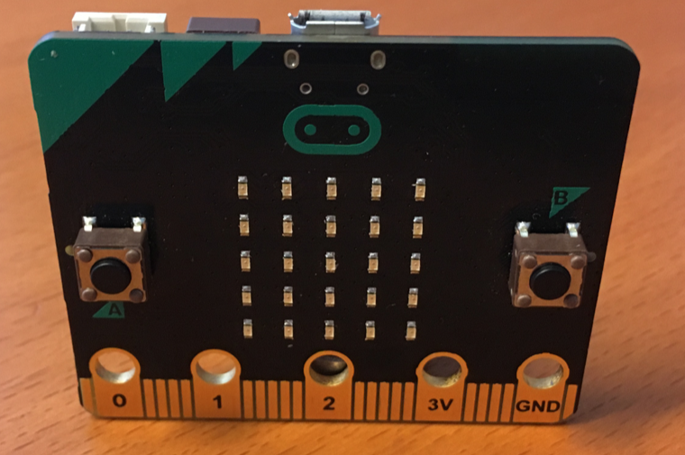
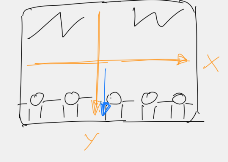
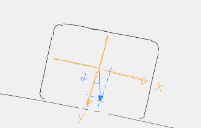
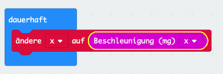
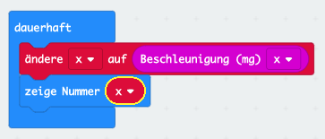
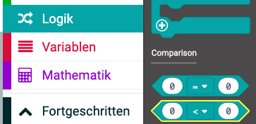
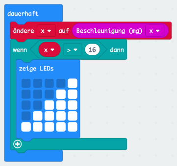
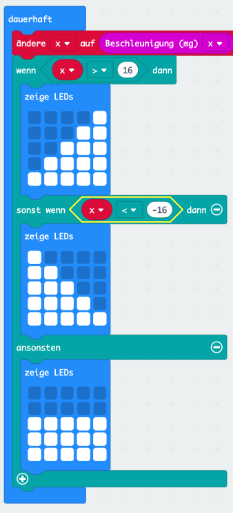

# Wasserwaage

## Einleitung

Einer der spannenden Sensoren des micro:bit ist der Beschleunigungssensor. Er kann Kräfte messen, z.B. die Gravitation der Erde oder wenn du den micro:bit anstösst.

Wir wollen diesen Sensor nutzen um eine elektronische Wasserwaage zu bauen. Damit könnt ihr in Zukunft alle Bilder schön gerade aufhängen.

Der micro:bit soll messen ob er genau waagerecht liegt und das auf dem Bildschirm anzeigen. Liegt er *schräg* soll die Anzeige angeben in welche Richtung.

## Verwendete (neue) Technologien

*   Beschleunigungssensor
*   Variablen
*   Logik

## Programmierung

### Schritt 1: Der Beschleunigungssensor

Der micro:bit enthält einen 3D-Beschleunigungssensor. Dieser kann Kräfte aus drei verschiedenen Richtungen messen. In der Mathematik nutzt die Namen x, y und z für die Richtungen im Raum.

Wenn der micro:bit flach auf dem Tisch liegt, so kann er nur eine Kraft sehen. Die Erdanziehung welche in Richtung "z" wirkt. In Richtung "x" oder "y" wirken keine Kräfte solange niemand den micro:bit hin- und herbewegt (genauer gesagt stösst). Das wollen wir ausprobieren.

*   Erstelle eine neues Programm.
*   **Wenn Knopf A gedrückt**.
*   **zeige Nummer**.
*   Platziere aus **Eingaben** den Block **Beschleunigung** in das **zeige Nummer** Feld.
*   Wähle bei **Beschleunigung** die Richtung **z** aus.

Dein Program sollte jetzt so aussehen. 

Lade es auf den micro:bit herunter und schau was passiert wenn du Knopf A drückst. Achte darauf dass dein micro:bit mit der Anzeige nach oben flach auf dem Tisch liegt.

Du solltest eine Zahl um -1000 sehen. Sie entspricht der Kraft welche am micro:bit in Z-Richtung zieht. Ihr kennt sie als Erdanziehungskraft (oder Gravitation). Ihr Wert ist 9.81 m/s2, man sagt dazu auch 1 **g** (g wie Gravitation).

Der micro:bit misst diese Kraft und zeigt dafür den Wert **1000** für **1 g** an. D.h. er zeigt 1000 * **g** an. Stellt euch das wie Gramm and Kilogramm vor. 

Da der micro:bit nicht ganz genau messen kann schwankt die Zahl ein wenig. Es kann gut sein, dass ihr einmal 970 oder 1020 und dann wieder 1005 angezeigt bekommt.

Wiederholt die Messung mehrere Male und schreibt euch den Wert auf. So bekommt ihr eine Idee wie genau der micro:bit messen kann. Im Durchschnitt sollte der Wert **1000** sein.

### Warum ist die Zahl negativ?

Wie du im Bild oben sehen kannst, zeigt für den micro:bit die Z-Achse nach oben. Da die Gravitation aber nach unten zieht wirkt sie genau entgegen der Z-Achse. Der micro:bit sieht sie also in die *entgegengesetzte* Richtung. Er zeigt sie daher als negative Zahl an. Wenn du den micro:bit auf den Kopf stellst wird die Zahl positiv. Allerdings ist sie dann nur schwer abzulesen.

### Und was ist mit den anderen Richtungen 

Wenn du das Programm änderst, so dass die Beschleunigung der **x** oder **y** Richtung angezeigt wird, siehst du nur eine sehr kleine Kraft. Dies liegt daran, dass der micro:bit ruhig auf dem Tisch liegt, und keine Kräfte wirken (sonst würde er sich bewegen).

Wenn du aber den micro:bit auf die lange Seite stellst erfährt sein Y-Sensor die Gravitationskraft. Du kannst diese messen wenn du im Block **Beschleunigung** die Richtung **z** durch **y** ersetzt.

## Schritt 2: Die Wasserwaage

Wir nutzen nun das Gelernte um eine Wasserwaage zu programmieren. Für die Wasserwaage wollen wir den micro:bit so halten, dass die lange Seite mit den Kontakten an dem Gegenstand aufliegt, der gerichtet werden soll.

Um zu prüfen ob der Gegenstand, respektive der micro:bit, genau waagerecht liegt können wir die Kraft in Y-Richtung oder X-Richtung auswerten (oder sogar beide).

Wenn der micro:bit exakt waagerecht liegt sollte in X-Richtung keine oder nur eine sehr geringe Kraft messbar sein. In Y-Richtung hingegen die ganze Erdbeschleunigung. Liegt er hingegen schräg, nimmt die Kraft in X-Richtung zu und in Y-Richtung ab.
Mit etwas Mathematik (Arkustangens) kann man aus den beiden Kräften den Winkel ausrechnen. 

 

Wir betrachten aber für unser Programm nur die Kraft in X-Richtung die ja möglichst 0 sein soll. Ist der Wert kleiner oder grösser als 0 wissen wir dass der micro:bit schräg liegt.

Erstelle im Makecode Editor ein neues Programm.

*   Da das Program diesmal dauernd laufen soll (nicht auf einen Knopfdruck) starte mit dem Block **dauerhaft**. Dieser liegt schon bereit.
*   Wie im ersten Program wollen wir die **Beschleunigung (mg) x** messen. Hole den Block aus **Eingaben**.

Wir wollen die Kraft diesmal aber nicht gleich anzeigen, sondern uns erst einmal merken. Um sich etwas zu merken verwenden Computerprogramme **Variablen**. Stellt euch diese wie kleine Kistchen vor, die einen Namen haben und im Kistchen etwas speichern können. Man kann die Variable setzen, d.h. etwas ins Kistchen legen. Man kann die Variable später lesen, resp. in das Kistchen schauen.

*   Wähle **Variablen**, **Erstelle eine Variable**. Ein Fenster öffnet sich. Gib den Namen **x** an und bestätige mit **Ok**.
*   Du siehst nun ein neues Feld mit dem Namen **x** und zwei Blöcke um die Variable zu setzen, respektive zu ändern (**ändere auf**, **ändere um**).

*   Nimm aus **Variablen** den Block **ändere x auf 0** und setze ihn in den **dauerhaft** Block.
*   Ersetze die **0** mit dem **Beschleunigung (mg) x** Block.

Nun müssen wir entscheiden ob unsere Wasserwaage, resp. der micro:bit ganz gerade liegt. Hier ist etwas ausprobieren nötig. Der Wert **x** ändert sich mehr oder weniger je nachdem wie schräg der micro:bit liegt. Am einfachsten wir zeigen den Wert erst einmal an.

*   Wähle aus **Grundlagen**, **zeige Nummer**.
*   Ersetze die **0** mit der Variable **x**.
*   Dazu holst du aus **Variablen** das Feld **x** und ziehst es auf die **0**.

Lade das Programm auf den micro:bit und finde heraus welche Zahlen der micro:bit misst wenn er gerade auf dem Tisch steht. Diese Zahlen wollen wir nun in unser Program einbauen um auf dem Bildschirm entweder eine gerade Linie oder eine schräge Linie anzuzeigen. Nehmen wir an die Zahlen schwanken zwischen -16 und +16.

In Worten soll unser Programm folgendes machen:

*   Wenn der Wert von **x** > 16 ist, dann zeichne eine schräge Linie nach rechts.
*   Sonst, wenn der Wert von **x** < -16 ist, dann zeichne eine schräge Linie nach links.
*   Sonst zeichne eine gerade Linie. **x** muss dann zwischen -16 und +16 sein.

Diese Art Programmteil nennt man **Logik**.

*   Entferne den "zeige Nummer" Block.
*   Nimm aus **Logik** den Block **wenn wahr dann**
*   Gehe erneut zu **Logik** und hole den Block mit dem **kleiner** Zeichen (im Bild gelb umrandet).

*   Setze diesen an die Stelle des **wahr** Feldes.
*   Hole die **Variable** **x** und setze sie in die linke **0**.
*   Wähle statt dem **kleiner** Zeichen das **grösser** Zeichen (Pfeil nach rechts).
*   Überschreibe die rechte **0** mit **16**.
*   Füge einen **zeige LEDs** Block ein, der eine Linie nach recht oben anzeigt. Erfinde selber eine schöne Zeichnung.

Das ist die erste unserer drei **Logik** Bedingungen. Wir fügen nun die zwei anderen ein. 

*   Klicke auf das kleine **(+)** Symbol unten link im **wenn** Block. Eine weitere Klammer öffnet sich.
*   Klicke erneut auf das **(+)** Symbol. Eine dritte Klammer erscheint.
*   Dupliziere die Bedingung **x > 16** von oben und füge sie bei der mittleren Klammer im Feld **sonst wenn .. dann** ein.
*   Wähle statt dem **grösser** Zeichen das **kleiner** (Pfeil nach links).
*   Ändere die Zahl auf **-16**.
*   Füge einen **zeige LEDs** Block ein der eine Linie nach links oben anzeigt. Erfinde selber eine schöne Zeichnung.
*   Füge einen dritten **zeige LEDs** Block in der Klammer **ansonsten** ein. Zeichne hier eine gerade Linie. 

Dein Program sollte nun ungefähr so aussehen. Du kannst es auf den micro:bit laden und ausprobieren. Wenn die Bilder dauernd hin- und herschalten muss du die Werte in der **Logik** Bedingung erhöhen (z.B. -24, 24).

## Ideen für Dich

*   Zeige mehrere schräge Linien ein, je nachdem wie der micro:bit gehalten wird. Dazu musst du die **Logik** entsprechend erweitern.

## Was haben wir gelernt

*   Variablen erstellen und ihnen Werte zuweisen.
*   Vergleiche machen
*   Variablen in Vergleichen benutzen.

## Programme

*   [Schritt 1](https://makecode.microbit.org/_T9YLrK51w7jM)
*   [Schritt 2](https://makecode.microbit.org/_eAb1mbW1w2uW)
