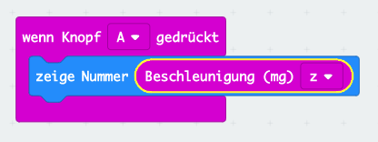

# Wasserwaage

## Einleitung

Einer der spannenden Sensoren des micro:bit ist der Beschleunigungssensor. Er kann Kräfte messen, z.B. die Gravitation der Erde oder wenn du den micro:bit anstösst.

Wir wollen diesen Sensor nutzen um eine elektronische Wasserwaage zu bauen. Damit könnt ihr in Zukunft alle Bilder schön gerade aufhängen.

Der micro:bit soll messen ob er genau waagerecht liegt und das auf dem Bildschirm anzeigen. Liegt er *schräg* soll die Anzeige angeben in welche Richtung.

## Verwendete (neue) Technologien

*   Beschleunigungssensor
*   Variablen
*   Logik

## Programmierung

### Schritt 1: Der Beschleunigungssensor

Der micro:bit enthält einen 3D-Beschleunigungssensor. Dieser kann Kräfte aus drei verschiedenen Richtungen messen. In der Mathematik nutzt man meistens die Namen x,y und z für die Richtungen im Raum.

Wenn der micro:bit flach auf dem Tisch liegt sollte er nur eine Kraft sehen. Die Erdanziehung welche in Richtung "z" wirkt. In Richtung "x" oder "y" wirken keine Kräfte solange niemand den micro:bit hin- und herbewegt (genauer stösst).

*   Erstelle eine neues Programm
*   **Wenn Knopf A gedrückt**.
*   **zeige Nummer**.
*   Platziere aus **Eingaben** den Block **Beschleunigung** in das **zeige Nummer** Feld.
*   Wähle bei **Beschleunigung** die Richtung **z** aus.

Dein Program sollte jetzt ungefähr so aussehen. 

Lade es auf den micro:bit herunter und schau was passiert, wenn du Knopf A drückst. Achte darauf dass dein micro:bit flach auf dem Tisch liegt, die Anzeige nach oben.

Es ist etwas schwierig zu sehen da die Zahl auf dem Bildschirm durchläuft. Aber du solltest eine Zahl um -1000 sehen.

Die Zahl ist die Kraft welche am micro:bit in Z-Richtung zieht. Ihr kennt sie als Erdanziehnugskraft oder Gravitation. Ihr Wert ist ca. 9.81 (m/s2). Der micro:bit misst genau diese Kraft und zeigt den Wert **1000** an wenn sie stimmt (**Hinweis**: 1000 entspricht einer Kraft von 9.81 m/s2)

Da die Gravitation nicht an jeder Stelle der Erde exakt den Wert 9.81 hat und der micro:bit auch nicht ganz genau messen kann schwankt die Zahl ein wenig. Es kann gut sein dass ihr einmal 970 oder 1020 und dann wieder 1000 angezeigt bekommt. 

Wiederholt die Messung mehrere Male und schreibt euch den Wert auf. So bekommt ihr eine Idee wie genau der micro:bit messen kann. Im Durchschnitt sollte der Wert **1000** sein.

### Warum ist die Zahl negativ?

Wie du im Bild oben sehen kannst zeigt für den micro:bit die Z-Achse nach oben. Da die Gravitation aber nach unten zieht wirkt sie genau entgegen der Z-Achse. Der micro:bit sieht sie also in die *falsche* Richtung. Er zeigt sie daher als negative Zahl an. Wenn du den micro:bit auf den Kopf stellst wird die Zahl positiv. Allerdings ist sie dann nur schwer abzulesen.

### Und was ist mit den anderen Richtungen 

Wenn du das Programm änderst, so dass die Beschleunigung der **x** oder **y** Richtung angezeigt wird, siehst du nur eine sehr kleine Kraft. Dies liegt daran, dass der micro:bit ruhig auf dem Tisch liegt, also keine Kraft anliegt (sonst würde er sich ja bewegen).

Wenn du aber den micro:bit auf die lange Seite stellst, kannst du mit der **y** Richtung wieder die Gravitation messen.

## Schritt 2: Die Wasserwaage

Wir nutzen nun das Gelernte um eine Wasserwaage zu programmieren. Für die Wasserwaage wollen wir den micro:bit so halten, dass die lange Kontaktseite an dem Bild (oder Gegenstand) aufliegt. 

Um zu prüfen ob der Gegenstand, respektive der micro:bit, genau waagerecht liegt können wir die Kraft in Y-Richtung oder X-Richtung auswerten (oder sogar beide).

Wenn der micro:bit exakt waagerecht liegt sollte in X-Richtung keine oder nur eine sehr geringe Kraft messbar sein. In Y-Richtung hingegen die ganze Erdbeschleunigung. Liegt er hingegen schräg, nimmt die Kraft in X-Richtung zu und in Y-Richtung ab.

Mit etwas höherer Mathematik (Arkustangens) kann man aus den beiden Kräften den Winkel ausrechnen. Wir nutzen aber als einfachste Variante die Kraft in X-Richtung die ja möglichst 0 sein soll.

Erstelle im Makecode Editor ein neues Programm.

*   Da das Program diesmal dauernd laufen soll (nicht auf einen Knopfdruck) starte mit dem Block **dauerhaft**. Dieser liegt schon bereit.
*   Wie im ersten Program wollen wir die **Beschleunigung (mg) x** messen. Hole den Block aus **Eingaben**

Wir wollen die Kraft diesmal aber nicht gleich anzeigen, sondern uns erst einmal merken. Um sich etwas zu merken verwenden Computerprogramme **Variablen**. Stellt euch diese wie kleine Kistchen vor, die einen Namen haben und im Kistchen etwas speichern können. Man kann die Variable setzen, d.h. etwas ins Kistchen legen. Man kann die Variable später lesen, resp. in das Kistchen schauen.

*   Wähle **Variablen**, **Erstelle eine Variable**. Ein Fenster öffnet sich. Gib den Namen **x** an und bestätige mit **Ok**.
*   Du siehst nun ein neues Feld mit dem Namen **x** und zwei Blöcke um die Variable zu setzen, respektive zu ändern (**ändere auf**, **ändere um**).

*   Wählt aus **Variablen** den Block **ändere x auf 0** und setze ihn in den **dauerhaft** Block.
*   Ersetze die **0** mit dem **Beschleunigung (mg) x** Block.

Nun müssen wir entscheiden ob unsere Wasserwaage, resp. der micro:bit ganz gerade liegt. Hier ist etwas ausprobieren nötig. Der Wert **x** ändert sich mehr oder weniger je nachdem wie schräg der micro:bit liegt. Am einfachsten wir zeigen den Wert erst einmal an.

*   Wähle aus **Grundlagen**, **zeige Nummer**.
*   Ersetze die **0** mit der Variable **x**.
*   Dazu holst du aus **Variablen** das Feld **x** und ziehst es auf die **0**.

Lade das Programm und finde heraus welche Zahlen der micro:bit misst wenn er gerade auf dem Tisch steht. Diese Zahlen wollen wir nun in unser Program einbauen um auf dem Bildschirm entweder eine gerade Linie oder eine schräge Linie anzuzeigen. Nehmen wir an die Zahlen schwanken zwischen -16 und +16.

In Worten soll unser Programm folgendes machen:
*   Wenn der Wert von **x** > 16 ist, dann zeichne eine schräge Linie nach rechts.
*   Sonst, wenn der Wert von **x** < -16 ist, dann zeichne eine schräge Linie nach links.
*   Sonst zeichne eine gerade Linie. **x** muss dann zwischen -16 und +16 sein.

Diese Art Programmteil nennt man **Logik**.

*   Entferne den "zeige Nummer" Block.
*   Nimm aus **Logik** den Block **wenn wahr dann**
*   Gehe erneut zu **Logik** und hole den Block mit dem **kleiner** Zeichen.

*   Setze dieses an die Stelle des **wahr** Feldes.
*   Hole die **Variable** **x** und setze sie in die linke **0**.
*   Wähle statt dem **kleiner** Zeichen das **grösser** (Pfeil nach rechts).
*   Überschreibe die rechte **0** mit **16**.
*   Füge einen **zeige LEDs** Block ein der eine Linie nach recht oben anzeigt. Erfinde selber eine schöne Zeichnung.

Das ist die erste unserer drei **Logik** Bedingungen. Wir fügen nun die zweite anderen ein. 

*   Klicke auf das kleine **(+)** Symbol unten link im **wenn** Block. Eine weitere Klammer öffnet sich.
*   Klicke erneut auf das **(+)** Symbol. Eine dritte Klammer erscheint.
*   Dupliziere die Bedingung **x > 16** von oben und füge sie bei der mittleren Klammer im Feld **sonst wenn .. dann** ein.
*   Wähle statt dem **grösser** Zeichen das **kleiner** (Pfeil nach links).
*   Ändere die Zahl auf **-16**.
*   Füge einen **zeige LEDs** Block ein der eine Linie nach links oben anzeigt. Erfinde selber eine schöne Zeichnung.
*   Füge einen dritten **zeige LEDs** Block in der Klammer **ansonsten** ein. Zeichne hier eine gerade Linie. 

Dein Program sollte nun ungefähr so aussehen. Du kannst es auf den micro:bit laden und ausprobieren. Wenn die Bilder dauernd hin- und herschalten muss du die Werte in der **Logik** Bedingung erhöhen (z.B. -24, 24).

## Schritt 3: Drei Himmelsrichtungen und viel Mathematik

Wir haben in Schritt 1 gesehen dass der micro:bit die Gravitation misst und dass diese ungefähr 1000 ist.

Der micro:bit *sieht* mit seinen Sensoren die Kraft aber nur genau in die Richtung in die er misst. Also z.B. in Richtung **Z**. Wenn die Kraft schräg anliegt, sieht er nur noch einen Teil davon. Da die Gravitation immer genau gerade nach unten zeigt, müsst ihr stattdessen euren micro:bit schräg halten um diesen Effekt zu sehen. Wenn ihr es ausprobiert werdet ihr sehen dass die Zahlen kleiner werden.  

Da die Gravitation der Erde aber nicht verschwindet, muss die Kraft ja trotzdem irgendwo sein. Das ist auch so, sie teilt sich nun einfach in verschiedene Richtungen auf (x, y und z). Wenn wir alle drei Richtungen des Sensors messen und zusammenzählen erhalten wir wieder die ganze Kraft. Das probieren wir nun aus und lernen dabei mit dem micro:bit zu rechnen.

Es wäre einfach wenn man die Kräfte aus x-, y- und z-Richtung einfach zusammenzählen könnte. Ganz so leicht ist es leider nicht. Die Mathematik will, dass wir das mit Wurzeln und Quadraten rechnen. Vielleicht habt ihr in der Schule schon mit Dreiecken gearbeitet und die Formel des Pythagoras gelernt. Das hier ist etwas ähnliches.

Das sieht recht kompliziert aus und macht keinen Spass im Kopf zu rechnen. Zum Glück haben wie unseren micro:bit Computer. **To compute** heisst ja nicht umsonst berechnen und genau das machen wir jetzt.

Als erstes wollen wir die Graviation in allen Richtungen messen und uns merken. Um sich etwas zu merken verwenden Computerprogramme **Variablen**. Stellt euch diese wie kleine Kistchen vor die einen Namen haben und im Kistchen etwas speichern können. Man kann die Variable setzen, d.h. etwas ins Kistchen legen. Man kann die Variable später lesen, resp. in das Kistchen schauen.

*   Wähle **Variablen**, **Erstelle eine Variable**. Ein Fenster öffnet sich. Gib den Namen **x** an und bestätige mit **Ok**.
*   Du siehst nun ein neues Feld mit dem Namen **x**

*   Erstelle auf dieselbe Weise Variablen mit Namen **y** und **z**.
*   Wir wollen nun die Kräfte jeder Richtung in den drei Variablen speichern.
*   Wählt dazu aus **Variablen** den Block **ändere x auf 0**.
*   Aendert die Variable auf **x** und das Zahlenfeld **0** auf **Beschleunigung (mg) x**.
*   Macht dasselbe für y und z. Ihr müsst jeweils die richtige Variable angeben und im Block **Beschleunigung (mg)** die Richtung.

*   Nachdem wir nun die Kräfte in den drei Variablen gespeichert haben geht die Rechnerei los.
*   Als erstes wollen wir die Quadrate von x, y und z berechnen. Quadrieren heisst mit sich selber multiplizieren, d.h. **y * y**.
*   Nehmt aus **Mathematik** den Block **0 x 0**.

*   Zieht aus **Variablen** das **x** in den Editor und legt diese in einem der beiden **0** ab. Macht dasselbe für die zweite **0**.
*   Klickt mit der rechten Mausstaste auf den Block und **dupliziert** ihn.
*   Aendert die Variablen **x** auf **y** ab.
*   Macht dasselbe auch für **z**.

Aus der komplizierten Formel von oben haben wir nun die Quadrate (x * x, y * y und z * z) berechnet. Als nächstes müssen wir die drei Zahlen addieren (zusammenzählen).

*   Nehmt dazu aus **Mathematik** den Block mit **0 + 0**
*   Zieht den Block **x * x** in das linke **0**, den Block **y * y** in das rechte **0**.
*   Damit haben wir ein Zwischenresultat, es fehlt noch das **z * z**.
*   Nehmt aus **Mathematik** nochmal den Block mit **0 + 0**
*   Zieht den grossen Block von vorhin in das linke **0**.
*   Zieht den Block **z * z** in das rechte **0**

Das sieht jetzt schon richtig kompliziert aus. Aber keine Angst wir sind fast fertig. Wir müssen nur noch die Wurzel ziehen. Wenn ihr (noch) nicht wisst was das ist, kein Problem. Auf jeden Fall sind Wurzeln im Kopf nur sehr schwer zu berechnen. Zum Glück kann der micro:bit auch das.

*   Zieht **Mathematik**, **Quadratwurzel 0** in den Editor.
*   Ersetzt die **0** mit dem komplizierten Rechnungsblock von vorhin.
*   Vielleicht seht ihr nun nicht mehr den ganzen Block im Editor. Für den Fall könnt ihr das Bild mit den **Zoom** Buttons verkleinern (oder auch vergrössern). Diese finden sich unten rechts im Editor und sehen so aus .

Wegen der Quadratwurzelhat unser Resultat nun leider auch noch ganz viele Kommastellen (z.B. 1030.3445785435). Diese wollen wir aber nicht anzeigen. Deswegen runden wir das Resultat auf eine ganze Zahl (1030). So kann man den Wert besser im Display ablesen.

Wir wollen dazu nochmal eine Variable verwenden
*   **Variable**, **Erstelle eine Variable**, Name **g**
*   Weise **g** den Wert der Berechnung zu indem du den Rechnungsblock in ein **ändere g auf 0** ziehst.
*   Setze die Variable **g** in den **zeige Nummer** Block.

Das fertige Program sollte wie folgt aussehen. Lade es herunter und probiere es aus. Da wir die Gravitation nun in alle drei Richtungen messen sollte die Zahl immer um **1000** sein, egal wie du den micro:bit hälst.

## Ideen für Dich

### Verbessere die Messung

Du hast sicher bemerkt dass die Messungen nicht immer den genau gleichen Wert liefern. Auch ist der Wert der Wasserwaage nicht exakt 0 wenn der micro:bit perfekt im Lot ist(waagerecht). Dies hängt mit zwei Effekten zusammen.

1.  Messungenauigkeit, Rauschen
2.  Kalibrierung

Der erste Effekt hängt damit zusammen dass jede Messung die (ein Computer) macht ein bisschen ungenau ist, da immer auch Störungen vorhanden sind.
Die Techniker verwenden Filter um diese Störungen so gut wie möglich zu eliminieren.

Ein einfacher Filter macht mehrere Messungen hintereinander und berechnet den Mittelwert aller Messungen.

*   Aendere das Program der Wasserwaage so ab dass es jeweils 8 Messungen macht.
*   Damit du nicht denselben Code immer wieder schreiben musst verwende eine Schleife.

Der zweite Effekt kommt daher dass der Sensor nicht exakt positioniert ist (z.B. etwas schräg auf dem Board verlötet).

Dies findet man mit einer sogenannten **Kalibrierung** heraus. Dabei wird der micro:bit auf eine exakt waagerechte Fläche gestellt und geschaut welchen Wert er misst. Dies kann z.B. +23 sein, obwohl wir eigentlich 0 erwarten. Diese Zahl wird dann bei allen Messungen jeweils abgezogen, was ein genaueres Resultat liefert.

*   Erweitere das Program so, dass es eine Kalibrierung durchführt wenn Taste **A** gedrückt wird.
*   Speichere den Wert in einer Variablen, z.B. **kal**.
*   Subtrahiere den Wert bei jeder laufenden Messung vom Messwert.

[Link](https://makecode.microbit.org/_EaLgh4CsTY6K)

### Spass mit Kräften

Was denkst du passiert wenn du den micro:bit schüttelst während du die Messung machst (Taste drücken).

Richtig: Dein Schütteln erzeugt zusätzliche Kraft. Die Kraft ist umso grösser je stärker du schüttelst. Da es schwierig ist während dem Schütteln auch noch den Wert abzulesen ändern wir das Program etwas ab. Der Wert soll auch angezeigt werden, wenn Taste **B** gedrückt wird.

Wie du siehst kannst du eine Variable wie **g** auch später im Program wieder verwenden. Ihr Inhalt bleibt erhalten solange das Program läuft, oder bis er geändert wird.

### Geringste und Höchste Kraft

*   Dauernde Messung der Kräfte.
*   Speichern des kleinsten und grössten je gemessenen Wertes.
*   Anzeigen wenn Taste A (kleinster Wert) oder B (grösster Wert) gedrückt wird.
*   Neustarten wenn Taste A+B gleichzeitig gedrückt.

[Link](https://makecode.microbit.org/_EaLgh4CsTY6K)

### Schwerelos

*   Dauernde Messung der Kräfte
*   Anzeige Smiley wenn schwerelos

[Link](https://makecode.microbit.org/_Y3Y98Vi2pKaX)

## Was haben wir gelernt

*   Variablen erstellen und ihnen Werte zuweisen
*   Variablwn in Rechnungen verwenden
*   Mathematische Berechnungen durchführen
*   Vergleiche machen

## Programme

*   Schritt 1: [makecode::level 1](https://makecode.microbit.org/_T9YLrK51w7jM)
*   Schritt 2: [makecode::level 3](https://makecode.microbit.org/_eAb1mbW1w2uW)
*   Schritt 3: [makecode::level 2](https://makecode.microbit.org/_h8xEFRVbCD3W)

