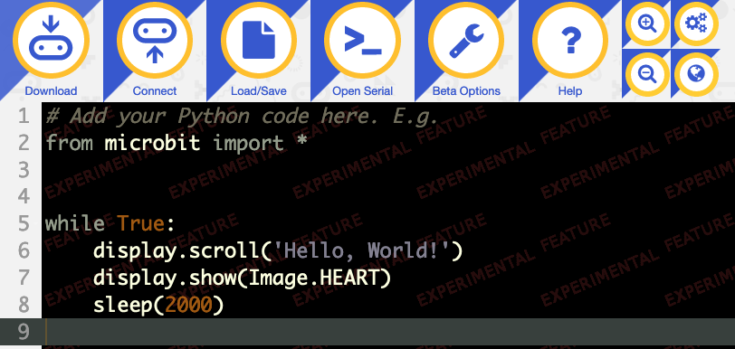
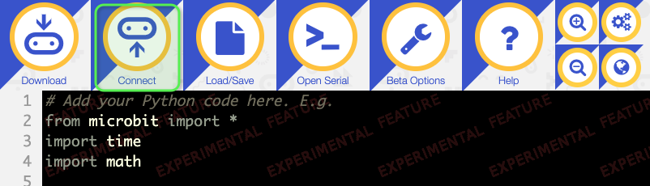
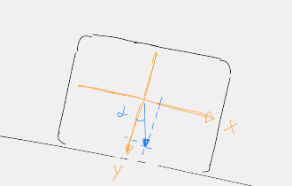

# Wasserwaage in Python

## Python Einleitung

Bisher haben wir den micro:bit mit dem Makecode Block Editor programmiert. Das hat den Vorteil dass man fast keine (Programmier-)Fehler machen kann. Allerdings ist man auch eingeschränkt auf die Blöcke die Makecode anbietet. 

Mehr Möglichkeiten bieten Programmiersprachen wie z.B. C++ oder Java. Diese sind aber viel schwerer zu lernen und daher für den Einstieg in die Programmierung nicht gut geeignet.

Eine tolle Lernsprache ist **Python**. Sie ist eine moderne Programmiersprache die sich einfach lernen lässt. Trotz der Einfachheit bietet sie alle Möglichkeiten einer richtigen Programmiersprache und man kann damit auch komplizierte Programme entwickeln. Deshalb arbeiten heute die meisten Schulen und Universitäten mit Python. Aber auch bei der Arbeit als Software Entwickler oder Ingenieur bist du mit Python bestens gerüstet. 

Wir werden im folgenden eine Aufgabe auf dem micro:bit in Python lösen. Mach dir keine Sorgen, wenn du (noch) nicht alles verstehst. Nimm es als Einstieg und erinnere dich später daran.
Alle Informationen zu Python findest du auf der offiziellen Homepage https://www.python.org/.


## Verwendete (neue) Technologien

*   Python Programmiersprache
*   Python Online Editor (Voraussetzung: English)


## Programmierung

### Python auf dem micro:bit

Im Gegensatz zu Makecode wird ein Python Programm in Form von Text eingegeben. 
Wie die meisten Programmiersprachen liest sich Python wie Englisch. Es ist also von Vorteil wenn du schon einige Worte Englisch kennst. Dann wirst du z.B. den folgenden Python Code problemlos verstehen.

```python
print('Hello Python')
```

Dieses Programm kannst du z.B. auf deinem Notebook laufen lassen. Aber sogar dein micro:bit unterstützt Python. Allerdings eine vereinfachte Variante, sie heisst **MicroPython**. Dies ist eine spezielle Version von Python die nicht alle Funktionen anbietet, dafür passt sie selbst in kleinste Computer, wie den micro:bit.


### Schritt 1: Das erste Python Program schreiben

Es gibt verschiedene Möglichkeiten den micro:bit mit MicroPython zu programmieren. Wir nutzen den offiziellen Online Python Editor des micro:bit Projekts.

*   Oeffne mit dem Browser die [MicroPython Website](https://python-editor-2-0-0-beta-4.microbit.org/#). 
*   Es öffnet sich ein Fenster in wir den Python Code unseres Programms eingeben können. Ein erstes Programm ist schon vorhanden.



*   Auch hier wollen wir mit einem einfachen **Hello micro:bit** Programm starten. Gib dazu das folgende Program ein. 
*   Ändere dazu einfach den Text ab, der schon vorhanden ist.

```python
from microbit import *

display.scroll('Hello micro:bit')
```

*   Falls du den Chrome Browser benutzt kannst du deinen micro:bit **verbinden**. Dadurch wird der Download einfacher. Wähle **Connect** im Menü des Editors (hier grün eingerahmt).



*   Wähle deinen micro:bit im Fenster das sich öffnet und drücke den **Connect** Knopf.
*   Um das Program auszuführen muss es auf den micro:bit kopiert werden. 
*   Wenn du deinen micro:bit verbunden hast, drücke den Button **Flash** ganz links im Menü. 
*   Ansonsten findest du an derselben Stelle den Button **Download**. Drücke ihn und speichere das Programm auf dem micro:bit.

Wenn alles geklappt hat siehst du nun einmal den Text `Hello micro:bit` auf dem Bildschirm. Danach passiert nichts mehr, da das Program nun zu Ende ist. Wir wollen es nun so umschreiben, dass der Text immer wieder (endlos) angezeigt wird. Ändere dazu das Program wie unten gezeigt.

```
from microbit import *
import time

while True:
    display.scroll('Hello micro:bit')
    time.sleep(1)   
```

*   Mit dem Befehl `while True:` (während Wahr) haben wir eine sogenannte Endlosschleife gebaut, die nie endet.
*   Um eine kleine Pause zu machen, nutzen wir die Funktion `sleep` aus dem Modul `time`. Module erweitern Python um neue Funktionen. Eine der Stärken von Python ist, dass es sehr viele Module gibt. Für fast jedes Problem wirst du ein Modul finden.
*   Achte darauf dass die Zeilen innerhalb des `while` Blocks wie gezeigt eingerückt sind. Python verlangt das so um zu wissen wo die Schleife beginnt, respektive endet. Diese Art Blöcke zu markieren erzwingt einen sauberen Programmierstil, der ein Program gut lesbar macht.
*   Downloade auch dieses Programm auf den micro:bit. 

Sollte das Programm nicht den gewünschten Text anzeigen, so hast du vermutlich einen Programmierfehler gemacht. Das ist kein Problem und passiert allen Programmierern. Lass uns in dem Fall zusammen schauen, wie wir den Fehler finden und beheben.


### Schritt 2: Wasserwaage einfach

In einer früheren Lektion haben wir bereits eine Wasserwaage programmiert. Wir wollen dieses Programm zum Vergleich nochmal in Python schreiben. Wir ändern es aber leicht ab.

Das Programm soll den Winkel den der micro:bit zur Erdachse hat messen. Wenn er 0° ist (exakt gerade), soll er einen Punkt (ein Pixel) in der Mitte des Bildschirms anzeigen. Wenn der micro:bit geneigt ist, soll der Punkt nach links oder rechts wandern. Der Punkt entspricht damit der Luftblase einer echten Wasserwaage.

Die Hauptaufgabe ist es den Winkel zu berechnen. Dazu benötigen wir die Beschleunigskräfte in X- und Y-Achse und eine Funktion aus der Trigonometrie. Sie heisst Arcustangens und berechnet aus X und Y den Winkel.



Während es in Makecode eher umständlich ist solche Berechnungen anzustellen, geht es in Python recht einfach. Vom `accelerometer` Modul fragen wir die Beschleuningswerte der zwei Achsen ab und merken sie uns in den Variablen x und y. Mit der Funktion `atan2` aus dem `math` Modul berechnen wir den Winkel. 

In der Technik hat ein Kreis per Definition nicht 360° sondern den Wert 2*Pi. Diese Einheit heisst Radian. Du hast vielleicht schon die entsprechenden Tasten auf deinem Taschenrechner gesehen.
Um das Program für uns einfach zu machen, rechnen wir den Radian Wert in Grad um.

```python
x = accelerometer.get_x()
y = accelerometer.get_y()
angle = math.atan2(x,y) / math.pi * 180    
```

Je nachdem wie du den micro:bit hälst können nun Winkelwerte von -90° bis +90° gemessen werden. Wir wollen unser Pixel aber nur die Werte von -2 bis +2 anzeigen lassen. Mehr Pixel hat der Bildschirm ja auch nicht. 
Der folgende Programmcode prüft ob der Winkel grösser 2.0 oder kleiner -2.0 ist. Falls ja, wird der Winkel auf diese Zahl begrenzt.
Beachte auch hier wieder wie der Programmcode eingerückt ist.

```python
if angle > 2.0:
    angle = 2.0

if angle < -2.0:
    angle = -2.0
```

Nachdem wir nun den Winkel kennen, und er auf +/- 2° begrenzt ist, können wir den Punkt auf dem Bildschirm anzeigen. Dazu müssen wir den Winkel, der eine reelle Zahl ist (z.B. 0.3785) auf eine ganze Zahl runden. Dazu benötigen wir die `round` Funktion. Da der Punkt für den Winkel 0° in der Mitte des Bildschirms sein soll, addieren wir noch die Position dieses Punktes (2).

```python
pos = round(2.0 + angle)
display.clear()
display.set_pixel(int(pos), 2, 9)
```

Das ganze Program sieht dann wie folgt aus. Hier noch einmal die wichtigsten Punkte:

1.  Die Beschleunigung wird in zwei Achsen gemessen und daraus mit der Arcustangens Funktion der Winkel berechnet (Dreiecksrechnung, Trigonometrie).
1.  Der Winkel wird von der Einheit Radian in Grad umgerechnet.
1.  Der Winkel wird auf +/-2° begrenzt damit er mit den fünf Punkten/Pixel des micro:bit angezeigt werden kann (-2, -1, 0, +1, +2).
1.  Aus dem Winkel wird die Position des Pixels (0 bis 4) bestimmt. 
1.  Der Bildschirm wird gelöscht und ein Pixel an der berechneten Position eingeschaltet.
1.  Nach einer kurzen Pause beginnt die Schleife von neuem.

Gebt das Programm so im Editor ein und probiert es auf dem micro:bit aus. Beachtet auch hier wieder die Einrückungen, sie sind wichtig. Wenn etwas nicht funktioniert, helfen wir euch.

```python
from microbit import *
import time
import math

while True:
    x = accelerometer.get_x()
    y = accelerometer.get_y()
    angle = math.atan2(x,y) / math.pi * 180    
    
    if angle > 2.0:
        angle = 2.0

    if angle < -2.0:
        angle = -2.0

    pos = round(2.0 + angle)
    display.clear()
    display.set_pixel(int(pos), 2, 9)

    time.sleep_ms(50)
```


### Schritt 2: Wasserwaage mit Kalibrierung

Ziemlich sicher ist der Punkt nicht in der Mitte des Bildschirms, auch wenn dein micro:bit exakt gerade liegt. Das liegt daran, dass der Sensor nicht exakt kalibriert ist. Anstelle des Winkels 0 wird eine leicht kleinere odere grössere Zahl gemessen (z.B. -1.5 statt 0.0).

Wir erweitern daher unser Programm um eine Kalibrierfunktion. Wenn die Taste **A** gedrückt ist, soll sich das Programm den aktuellen Messwert merken. Dieser Fehlerwert soll dann bei allen folgenden Messungen abgezogen werden, so dass der Fehler der Messung verschwindet.

1.  Die Variable ```calibration``` soll den Fehlerwert speichern. Ihr Startwert ist 0.
1.  Wenn Taste **A** gedrückt ist, wird der gemessene Wert nicht angezeigt, sondern als Fehlerwert gemerkt.
1.  Vor der Anzeige eines Messwerts wird immer der Fehlerwert vom gemessenen Wert abgezogen.

Erweitert euer Programm bis so es aussieht wie unten gezeigt. Wenn ihr nun den micro:bit genau gerade auf dem Tisch haltet könnt ihr die Taste **A** drücken. Wenn ihr die Taste wieder loslasst hat der micro:bit gelernt um wieviel er falsch gemessen hat und er korrigier das. Der Punkt sollte nun in der Mitte sein.

```python
from microbit import *
import time
import math

calibration = 0.0

while True:
    x = accelerometer.get_x()
    y = accelerometer.get_y()
    angle = math.atan2(x,y) / math.pi * 180    
    
    if button_a.is_pressed():
        display.show(Image.ARROW_S)
        calibration = angle
    else:
        angle = angle - calibration

        if angle > 2.0:
            angle = 2.0

        if angle < -2.0:
            angle = -2.0
        
        pos = round(2.0 + angle * 1.0)
        display.clear()
        display.set_pixel(int(pos), 1, 9)

    time.sleep_ms(50)
```


## Ideen für Dich

*   Vermutlich hast du bemerkt, dass der Punkt etwas herumspringt. Das hängt mit der Ungenauigkeit (dem Rauschen) der Messung zusammen. Mit einem Filter kann man das verbessern. 
*   Verbessere das Program so, dass es mehrere Messungen hintereinander macht und den Durchschnitt aller Werte berechnet. Dadurch wird das Rauschen gefiltert und die Messung wird genauer.
*   Verbessere die Anzeige. Zeige anstelle des Punktes z.B. eine Linie an, die gerade oder schräge ist, je nach Lage des micro:bit.


## Was haben wir gelernt

*   Programmieren mit MicroPython
*   Endlosschleifen (while), Bedingungen (if)
*   Tastenabfrage
*   Anzeige eines Punktes (Pixels) auf dem Bildschirm
*   Mathematische Berechnungen (Arcustangens, Runden)


## Programme

*   [Hello](./hello.py)
*   [Wasserwaage 1](./level_1.py)
*   [Wasserwaage 2](./level_2.py)
*   [Wasserwaage komplett](./level_final.py)
