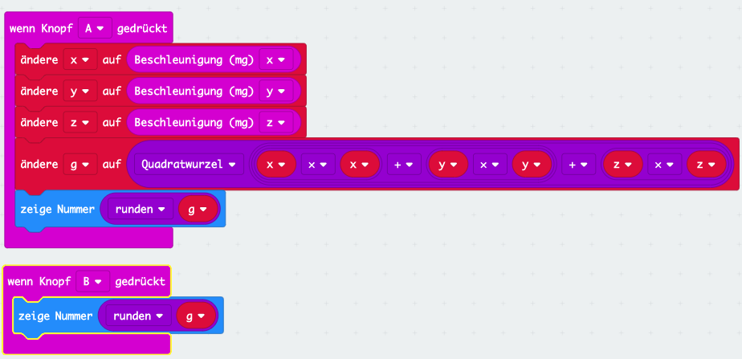

# Gravitation

## Einleitung

Mit etwas Mathematik kann man mit dem micro:bit die Gravitationskraft messen. Da sein Sensor drei Kräfte (einen für jede Raumrichtung) misst müssen diese miteinander verrechnet werden.

Wie bei jeder Messung ist auch hier die Genauigkeit wichtig. In Schritt 2 zeigen wir, wie man dank einem Filter und Kalibrierung präziser messen kann.

## Verwendete (neue) Technologien

*   Beschleunigungssensor
*   Variablen
*   Mathematik

## Programmierung

## Einleitung: Drei Himmelsrichtungen und viel Mathematik

Wir haben in Lektion 3 - Wasserwaage gesehen, dass der micro:bit die Gravitation misst und dass diese ungefähr 1000 ist.

Der micro:bit *sieht* mit seinen Sensoren die Kraft aber nur genau in die Richtung in die er misst. Also z.B. in Richtung **Z**. Wenn die Kraft schräg anliegt, sieht er nur noch einen Teil davon. Da die Gravitation immer genau gerade nach unten zeigt, müsst ihr stattdessen euren micro:bit schräg halten um diesen Effekt zu sehen. Wenn ihr es ausprobiert werdet ihr sehen dass die Zahlen kleiner werden.

Da die Gravitation der Erde aber nicht verschwindet, muss die Kraft ja trotzdem irgendwo sein. Das ist auch so, sie teilt sich aus Sicht des micro:bit in verschiedene Richtungen auf (x, y und z genannt). Wenn wir jede Richtung mit dem Sensor des micro:bit messen und zusammenzählen erhalten wir wieder die ganze Kraft. Das probieren wir nun aus und lernen dabei mit dem micro:bit zu rechnen.

Es wäre einfach wenn man die Kräfte aus x-, y- und z-Richtung einfach zusammenzählen könnte. Ganz so leicht ist es leider nicht. Die Mathematik will, dass wir das mit Wurzeln und Quadraten rechnen. Vielleicht habt ihr in der Schule schon mit Dreiecken gearbeitet und die Formel des Pythagoras gelernt. 

Die Formel sagt wie man die Länge von **c**, berechnen kann wenn man **a** und **b** kennt. Hier haben wir zwei Richtungen (a und b). **a** und **b** sind in diesem Beispiel die Kraft in **x** und **y** Richtung, **c** die ganze Kraft. Das nennt man Vektorrechnung (lernt ihr später in der Schule).

Beim Versuch mit der Schwerkraft sind es sogar drei Richtungen, dadurch wird die Formel noch etwas komplizierter.

Diese Formel im Kopf zu rechnen macht nun wirklich keinen Spass. Zum Glück haben wie unseren micro:bit Computer. **To compute** heisst ja nicht umsonst **rechnen** und genau das machen wir jetzt.

## Schritt 1: Drei Himmelsrichtungen, viel Mathematik und Variablen

Als erstes wollen wir die Kraft in allen Richtungen messen und uns merken. Um sich etwas zu merken verwenden Computerprogramme **Variablen**. Stellt euch diese wie kleine Kistchen vor die einen Namen haben und im Kistchen etwas speichern können. Man kann die Variable setzen, d.h. etwas ins Kistchen legen. Man kann die Variable später lesen, resp. in das Kistchen schauen.

*   Wähle **Variablen**, **Erstelle eine Variable** und lege die Variable **x** an.
*   Erstelle auf dieselbe Weise Variablen mit Namen **y** und **z**.
*   Wir wollen nun die Kräfte jeder Richtung in den drei Variablen speichern.
*   Wählt dazu aus **Variablen** den Block **ändere x auf 0**.
*   Ändert die Variable auf **x** und das Zahlenfeld **0** auf **Beschleunigung (mg) x**.
*   Macht dasselbe für y und z. Ihr müsst jeweils die richtige Variable angeben und im Block **Beschleunigung (mg)** die Richtung.

Nachdem wir nun die Kräfte in den drei Variablen gespeichert haben geht die Rechnerei los. Als erstes wollen wir die Quadrate von x, y und z berechnen. Quadrieren heisst mit sich selber multiplizieren, d.h. **y * y**.

*   Nehmt aus **Mathematik** den Block **0 x 0**.

*   Zieht aus **Variablen** das **x** in den Editor und legt dieses in einem der beiden **0** ab. Macht dasselbe für die zweite **0**.
*   Klickt mit der rechten Maustaste auf den Block und **dupliziert** ihn.
*   Ändert die Variablen **x** auf **y** ab.
*   Macht dasselbe auch für **z**.

Aus der komplizierten Formel von oben haben wir nun die Quadrate (x * x, y * y und z * z) berechnet. Als nächstes müssen wir die drei Zahlen addieren (zusammenzählen):

*   Nehmt dazu aus **Mathematik** den Block mit **0 + 0**
*   Zieht den Block **x * x** in das linke **0**, den Block **y * y** in das rechte **0**.
*   Damit haben wir ein Zwischenresultat, es fehlt noch das **z * z**.
*   Nehmt aus **Mathematik** nochmal den Block mit **0 + 0**
*   Zieht den grossen Block von vorhin in das linke **0**.
*   Zieht den Block **z * z** in das rechte **0**

Das sieht jetzt schon richtig kompliziert aus. Aber keine Angst wir sind fast fertig. Wir müssen nur noch die Wurzel ziehen. Wenn ihr (noch) nicht wisst was das ist, kein Problem. Auf jeden Fall sind Wurzeln im Kopf nur sehr schwer zu berechnen. Zum Glück kann der micro:bit auch das:

*   Zieht **Mathematik**, **Quadratwurzel 0** in den Editor.
*   Ersetzt die **0** mit dem komplizierten Rechnungsblock von vorhin.
*   Vielleicht seht ihr nun nicht mehr den ganzen Block im Editor. Für den Fall könnt ihr das Bild mit den **Zoom** Buttons verkleinern (oder auch vergrössern). Diese finden sich unten rechts im Editor und sehen so aus.

.

Wegen der Quadratwurzel hat unser Resultat nun leider auch noch ganz viele Kommastellen (z.B. 1030.3445785435). Diese wollen wir aber nicht anzeigen. Deswegen runden wir das Resultat auf eine ganze Zahl (1030). So kann man den Wert besser im Display ablesen.

Wir wollen dazu nochmal eine Variable verwenden:

*   **Variable**, **Erstelle eine Variable**, Name **g**
*   Weise **g** den Wert der Berechnung zu indem du den Rechnungsblock in ein **ändere g auf 0** ziehst.
*   Setze die Variable **g** in den **zeige Nummer** Block.

Das fertige Program sollte wie folgt aussehen. Lade es herunter und probiere es aus. Da wir die Gravitation nun in alle drei Richtungen messen sollte die Zahl immer um **1000** sein, egal wie du den micro:bit hälst. Auf der Erde solltest du nun immer den Wert 1000 erhalten.

### Schritt 2: Verbessere die Messung

Du hast sicher bemerkt, dass die Messungen nicht immer den genau gleichen Wert liefern. Auch ist der Wert der Wasserwaage nicht exakt 0 wenn der micro:bit perfekt im Lot ist(waagerecht). Dies hängt mit zwei Effekten zusammen.

1.  Messungenauigkeit
2.  Kalibrierung

Der erste Effekt kommt daher, dass jede Messung die (ein Computer) macht ein bisschen ungenau ist, da immer auch Störungen vorhanden sind. Die Techniker verwenden Filter um diese Störungen so gut wie möglich zu eliminieren.

Ein einfacher Filter macht z.B. mehrere Messungen hintereinander und berechnet den Mittelwert aller Messungen. So werden die zufälligen Störungen herausgerechnet.

*   Ändere das Program so ab dass es jeweils 8 Messungen macht.
*   Damit du nicht denselben Code immer wieder schreiben musst verwende eine Schleife.

Der zweite Effekt kommt daher, dass der Sensor nicht exakt positioniert ist (z.B. etwas schräg auf dem Board verlötet).

Dies findet man mit einer sogenannten **Kalibrierung** heraus. Dabei wird der micro:bit auf eine exakt waagerechte Fläche gestellt und geschaut welchen Wert er misst. Dies kann z.B. +23 sein, obwohl wir eigentlich 0 erwarten. Diese Zahl wird dann bei allen Messungen  abgezogen, was ein genaueres Resultat liefert.

*   Erweitere das Program so, dass es eine Kalibrierung durchführt wenn Taste **A** gedrückt wird.
*   Speichere den Wert in einer Variablen, z.B. **kal**.
*   Subtrahiere den Wert bei jeder laufenden Messung vom Messwert.

[Link](https://makecode.microbit.org/_EaLgh4CsTY6K)

## Ideen für Dich

### Spass mit Kräften

Was denkst du passiert wenn du den micro:bit schüttelst während du die Messung machst (Taste drücken).

Richtig: Dein Schütteln erzeugt eine zusätzliche Kraft. Die Kraft ist umso grösser je stärker du schüttelst. Da es schwierig ist während dem Schütteln auch noch den Wert abzulesen ändern wir das Program etwas ab. Der Wert soll auch angezeigt werden, wenn Taste **B** gedrückt wird.

Wie du siehst kannst du eine Variable wie **g** auch später im Program wieder verwenden. Ihr Inhalt bleibt erhalten solange das Program läuft, oder bis er geändert wird.

### Geringste und Höchste Kraft

*   Dauernde Messung der Kräfte.
*   Speichern des kleinsten und grössten je gemessenen Wertes.
*   Anzeigen wenn Taste A (kleinster Wert) oder B (grösster Wert) gedrückt wird.
*   Neustarten wenn Taste A+B gleichzeitig gedrückt.

[Link](https://makecode.microbit.org/_EaLgh4CsTY6K)

### Schwerelos

*   Dauernde Messung der Kräfte.
*   Anzeige eines Smiley wenn schwerelos.

[Link](https://makecode.microbit.org/_Y3Y98Vi2pKaX)

## Was haben wir gelernt

*   Mathematische Berechnungen durchführen
*   Variablen in Rechnungen verwenden
*   Zoom Funktion des Editors

## Programme

*   Schritt 1: [makecode](https://makecode.microbit.org/_h8xEFRVbCD3W)
