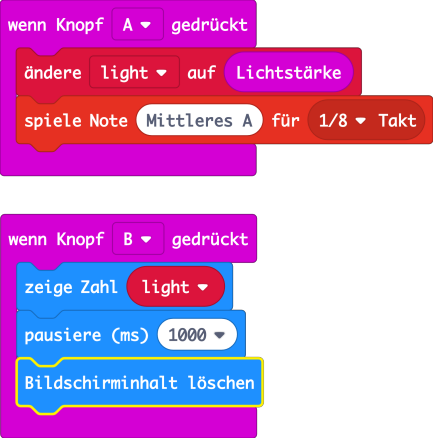

# Schulsack Alarm

## Einleitung

Niemand soll einfach so in deinem Schulsack herumkramen oder sogar daraus etwas stehlen. Lasst uns eine Alarmanlage bauen, die alle Diebe mit lautem Geräusch erschreckt.

## Verwendete (neue) Technologien

*   micro:bit Musik und Geräusche
*   micro:bit Lichtsensor
*   Piezosummer

## Programmierung

### Schritt 1: Musik mit dem micro:bit

Dem micro:bit fehlt ein Lautsprecher um Musik auszugeben. Das Problem können wir aber einfach lösen. Mit einem paar Krokodilklemmen kannst du einfach einen Kopfhörer anschliessen.

Dazu verbindest du die Pins **GND** und **0** mit dem Anschluss des Kopfhörers. Am Pin **0** gibt der micro:bit das Tonsignal aus. Über Pin **GND** (Ground) kehrt der Strom zurück.

Leider kannst du auf diese Art keinen Lautsprecher ansteuern (oder höchstens einen ganz kleinen). Dieser benötigt mehr Strom als der micro:bit am Pin **0** zur Verfügung stellen kann.

Es gibt aber ein Bauteil, den **Piezosummer** der ebenfalls Töne erzeugen kann und dazu nur ganz wenig Strom braucht. Er tönt zwar nicht so gut wie ein Lautsprecher, für einen Alarm ist er aber genau richtig.

*   Damit es keinen Kurzschluss geben kann, entfernt ihr den micro:bit vom Strom (PC oder Batterie).
*   Schliesst den Piezosummer mit den Krokodilklemmen wie unten gezeigt an den micro:bit an.
*   Prüft nochmal sorgfältig ob die Verbindung ok ist. Schliesst dann den micro:bit wieder an den PC an.

### Schritt 2: Erste Töne

Wir wollen nun ausprobieren ob der micro:bit auch wirklich Musik machen kann. Erstellt dazu folgendes Programm und testet es im Simulator. Wenn der Ton deines PC eingeschaltet ist, wirst du das Klingeln eines Telefons hören, nachdem Taste A gedrückt ist.

Lade das Program auf den micro:bit. Du solltest die Musik aus dem Piezosummer hören. Sie tönt etwas _blechern_, aber ist doch gut zu hören.

Wer Lust hat und sich mit Noten auskennt kann statt der fertigen Melodie auch ein Musikstück selber eingeben. Probiert das folgende Programm aus.

### Schritt 3: Der Lichtsensor

Um festzustellen ob dein Schulsack geöffnet wird, nutzen wir den Lichtsensor des micro:bit. Der Lichtsensor liefert eine Zahl die um so grösser wird, je heller es ist. **0** bedeutet dabei kein Licht, **255** heller Sonnenschein.

Wenn du dich fragst wo der Lichtsensor sitzt, wirst du überrascht sein. Der micro:bit hat gar keinen speziellen Lichtsensor. Er nutzt dazu seine Leuchtdioden, die eigentlich Licht erzeugen. Spannend nicht wahr? Dass das funktioniert hat mit der Physik der Halbleiter zu tun, zu der auch die LED gehört.

Ein wichtiger Punkt den du dir merken musst ist, dass du nicht die LEDs gleichzeitig mit dem Lichtsensor nutzen kannst. Wenn die LEDs eingeschaltet sind, misst der Sensor falsch (das Licht der LEDs).

Wir probieren das nun aus. Das folgende Programm misst die Helligkeit wenn du Knopf A drückst. Den Wert merkt es sich in der Variable **light**, damit wir ihn später anzeigen können. Würden wir den Wert sofort anzeigen, wird die nächste Messung gestört.

Probiere das Program auf dem micro:bit aus. Welchen Wert erhältst du wenn der micro:bit auf dem Tisch liegt? Welchen Wert erhältst du wenn du den micro:bit zudeckst (oder in deine Tasche steckst)?

### Schritt 4: Die Alarmanlage

Wir setzen das gelernte nun zusammen um eine Alarmanlage für deinen Schulsack zu bauen. Dazu soll der micro:bit erkennen ob die Tasche geöffnet wird. Falls ja, soll er nach kurzer Zeit einen Alarmton abspielen. 

Wie jede Alarmanlage soll man sie Ein- und Ausschalten können. Für das Ausschalten nutzen wir die Tastenkombination **A+B** sozusagen als Geheimcode. Zum Einschalten kann Taste **A** verwendet werden.

Im folgenden siehst du ein mögliches Program. Die Besonderheit daran ist, dass wir einen **dauerhaft** Block einsetzten. Dieser führt seinen Inhalt dauernd aus, lässt aber trotzdem zu dass z.B. eine Taste abgefragt werden kann. So können wir mehrere Dinge gleichzeitig tun.

*   Taste A abfragen: Alarm einschalten.
*   Tasten A+B abfragen: Alarm ausschalten.
*   **dauerhaft** im Hintergrund
    *   Falls Alarm eingeschaltet ist, Helligkeit messen 
    *   Alarm ausgeben wenn Licht detektiert wurde

In diesen Programm sieht du noch etwas Neues. Bei den Blöcken **wenn Knopf** ist ein Kommentar geschrieben. Kommentare sind ein wichtiger Punkt beim Programmieren. Sie erlauben dem Programmierer zu notieren, was er im Kopf hatte als das Programm geschrieben wurde. So kann man auch später wieder herausfinden was das Programm eigentlich machen soll. Etwas das sonst schnell vergessen geht.

Um in Makecode einen Kommentar zu schreiben gehst du wie folgt vor:

*   Wähle einen Block, so dass er markiert ist (gelber Rahmen).
*   Drücke die recht Maustaste um das Menü anzuzeigen.
*   Wähle **Kommentar hinzufügen**.
*   In dem kleinen Feld das sich öffnet kannst du deine Gedanken notieren. Ist das Feld zu klein kannst du es mit der Maus vergrössern (unten rechts). Ebenso kannst du es an eine andere Stelle schieben.

## Ideen für Dich

*   Löse den Alarm erst nach ein paar Sekunden aus, so dass du Zeit hast den Alarm auszuschalten, wenn du den Sack öffnest.
*   Lasse eine Leuchtdiode alle 1 Sekunde kurz aufblitzen, damit man sieht wenn der Alarm scharf ist.

## Was haben wir gelernt

*   Piezosummer an den micro:bit anschliessen, Musik/Töne ausgeben
*   Lichtsensor des micro:bit anwenden
*   Ein Programm im Hintergrund laufen lassen
*   Variablen nutzen um das Program zu steuern (Alarm ein oder aus)
*   Kommentare hinzufügen

## Programme

*   Schritt 3: [makecode::light](https://makecode.microbit.org/_MrDipcUU2Hec)  
*   Schritt 4: [makecode::alarm](https://makecode.microbit.org/_ATmidMRt4dmH)  
*   Idee 1: [makecode::alarm 2](https://makecode.microbit.org/_4CpJ72DY5faV)  

