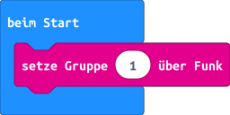
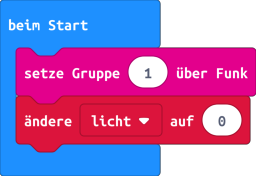
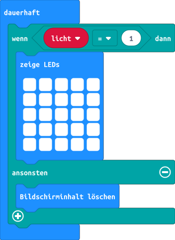
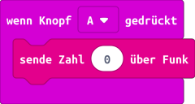
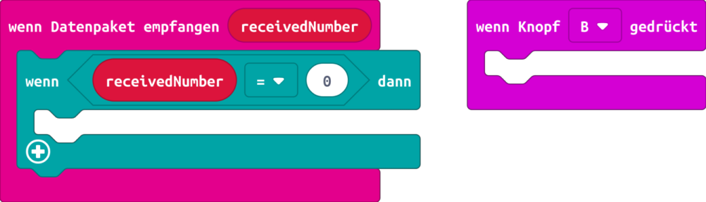
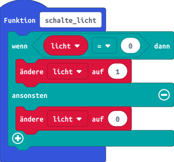
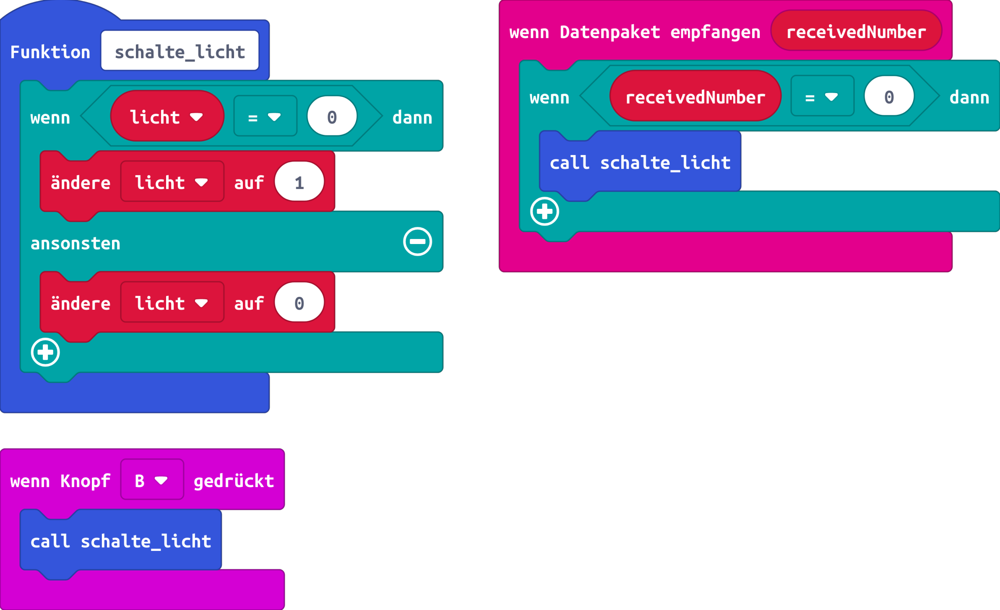

# Funklichtschalter

## Einleitung

Eine wichtige Fähigkeit von Computern ist es, dass sie miteinander kommunizieren können. In dieser Übung lernen wir, wie sich zwei Programme, welche auf verschiedenen Rechnern laufen, miteinander austauschen können, unabhängig von der Programmiersprache in der sie geschrieben sind.


### Eine kurze Geschichte der Kommunikationstechnik

Seit jeher haben Menschen (und auch Tiere) das Bedürfnis über kurze und weite Distanzen Informationen auszutauschen. Frühe Formen davon sind Trommeln, Meldeläufer, Feuer- und Rauchzeichen, Brieftauben oder auch das Postsystem. All diese Systeme haben aber entweder eine lange Übertragungszeit (bspw. die Post) oder sind auf eine Sichtverbindung angewiesen.

Dies sollte sich mit der Erfindung der elektrischen Telegrafie Anfangs des 19. Jahrhunderts ändern. Innerhalb von wenigen Jahrzehnten, zusammen mit den neuen Eisenbahnlinien, breitete sich die Technik rund um den Globus aus. Mit den ersten Unterseekabeln wurde Kommunikation über die Ozeane hinweg in sekundenschnelle möglich. Die Nachrichten wurden meist mit dem Morse-Code kodiert: Jeder Buchstabe wurde durch eine Folge von kurzen und langen Tönen ersetzt.

Doch was wäre, wenn man dafür keine Kabel bräuchte? Nur wenige Jahre nachdem Maxwell und Hertz den theoretischen respektive den experimentellen Nachweis für die Existenz von Radiowellen erbrachten, gelang Marconi in den 1890er Jahren die erste Funkverbindung. Der Name "Funk" stammt dabei von der Tatsache, dass erste Sender zum Erzeugen der Radiowellen eine Funkenstrecke einsetzten.

Auf [Wikipedia](https://upload.wikimedia.org/wikipedia/commons/3/36/Marconi%27s_first_radio_transmitter.jpg) findet sich ein Bild des ersten Senders von Marconi.

Im 20. Jahrhundert wurde dann Sprachfunk und Rundfunk (Radio, später Fernsehen) entwickelt. Mit der Allgegenwärtigkeit von Computern wurde die Funkübertragung digitalisiert, so dass auch Rechner miteinander ohne Drahtverbindung kommunizieren können.

Heute können wir uns ein Leben ohne drahtlose Kommunikation fast nicht mehr vorstellen. WLAN und Mobilfunk sind allgegenwärtig. Kleine Sensoren übertragen Messdaten drahtlos. Satellitenkommunikation ermöglicht die Erreichbarkeit von einem beliebigen Punkt auf der Erdoberfläche und wir können mit Hilfe von grossen Antennen mit Raumsonden kommunizieren, welche bereits Milliarden Kilometer von uns weg sind.


### Funkschnittstelle des micro:bit

Der Prozessor des micro:bit besitzt eine eingebaute Funkschnittstelle, welche im Frequenzbereich 2.4 GHz (sprich Gigahertz) arbeitet. Das heisst, dass die Radiowellen, welche zur Übertragung verwendet werden, 2'400'000'000 mal pro Sekunde hin- und herschwingen.

Die Daten werden per Frequenzmodulation übertragen. Wenn wir beispielsweise den Buchstaben **A** übertragen wollen, so ist dies im micro:bit als ```01000001``` gespeichert. Senden wir es nun über die Funkschnittstelle, so wird für eine **0** die Frequenz der Radiowellen ein wenig reduziert und für eine **1** die Frequenz ein wenig erhöht. Der Empfänger sieht diese Frequenzänderung und kann aus daraus wieder die digitalen Daten lesen. 

Der micro:bit kennt zwei verschiedene Funkprotokolle:

* Bluetooth Low Energy, welches die Kommunikation mit Computern, Smartphones, Tablets usw. erlaubt.

* Eigenes, einfaches Protokoll, welches nur vom micro:bit verstanden wird. Es erlaubt es uns, Zahlen, Text, Variablen und sogar Tastendrücke zu übertragen. Für die nächste Übung werden wir dieses Protokoll verwenden.

Doch was ist ein Protokoll eigentlich? Ein Protokoll gibt vor, wie Nachrichten verpackt werden müssen, damit sie von der Gegenseite verstanden werden. Man kann sich dies ein wenig wie Briefumschläge vorstellen, auf denen an vorgegebenen Stellen die Adresse des Absenders und des Empfängers steht. Ausserdem werden weitere Hinweise angebracht, wie *A-Post* oder *Eingeschrieben*, das wäre in unserem Fall eine Nachricht, welche schnell weiterverarbeitet werden respektive Absender quittiert werden soll.


## Verwendete Technologien

* Makecode Online Editor
* Block Programmiersprache
* Funkschnittstelle


## Programmierung

In dieser Übung programmieren wir einen einfachen Funklichtschalter. Die LED-Anzeige ist dabei die Lampe. Die Taste A des micro:bit ist dabei der Lichtschalter für die entfernte Lampe und die Taste B soll als Schalter für die eigene Lampe dienen.

Mit dem Drücken des Schalters soll die Lampe eingeschaltet werden, ein erneuter Tastendruck schaltet die Lampe wieder ab.

Diese Übung führen wir in Zweiergruppen durch. Jede Gruppe wird von uns eine Gruppennummer erhalten. Dadurch stellen wir sicher, dass nur eure zwei micro:bits sich verstehen können und ihr so nicht die Tests der anderen Gruppen beeinflusst.

Die Gruppe kann man mit folgendem Block aus dem Menu **Funk** eingestellt werden, welcher beim Start ausgeführt werden soll:



Da wir unser Licht auf verschiedene Weise ein- und ausschalten wollen, speichern wir den Zustand des der Lampe in der Variable ```licht```, welche wir auf 0 initialisieren, damit die Lampe beim Aufstarten aus ist.



Im Block, der dauerhaft ausgeführt wird, wollen wir nun abhängig vom Inhalt der Variable ```licht``` die Lampe ein- oder ausschalten:



Wenn wir Taste A drücken, senden wir die Zahl 0 über Funk um die Lampe am anderen micro:bit zu schalten: 



Nun müssen wir noch auf die Funkmeldung des anderen micro:bit hören um die Lampe auf unserem micro:bit zu schalten. Wenn die Taste B gedrückt wird, müssen wir dasselbe tun.



Damit wir den Programmteil, der den Inhalt der Variable ```licht``` ändert nur einmal schreiben müssen, erstellen wir die Funktion ```schalte_licht```. Eine Funktion ist ein Programmteil, der immer wieder aufgerufen werden kann unter dem vergebenen Namen. Die Funktion ändert beim Aufruf den Inhalt von ```licht``` wenn er aktuell 0 ist nach 1 und umgekehrt.



Nun fügen wir den Aufruf der Funktion in die beiden Lücken ein.




Das Programm könnt ihr nun erst mit dem Simulator testen und dann, wenn alles funktioniert, auf eure micro:bit herunterladen.


## Was haben wir gelernt

*   Nutzen der Funkschnittstelle
*   Erstellen von einfachen Funktionen

## Programme

*   [makecode::Funklichtschalter](https://makecode.microbit.org/_g6a0a4Y0sMuX)
