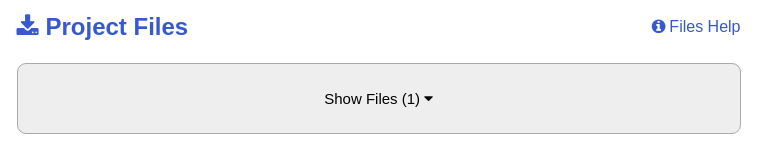
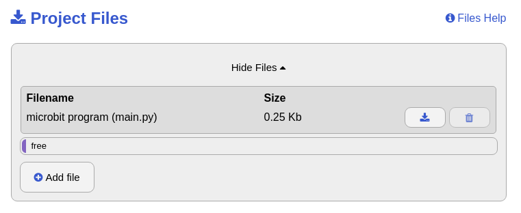
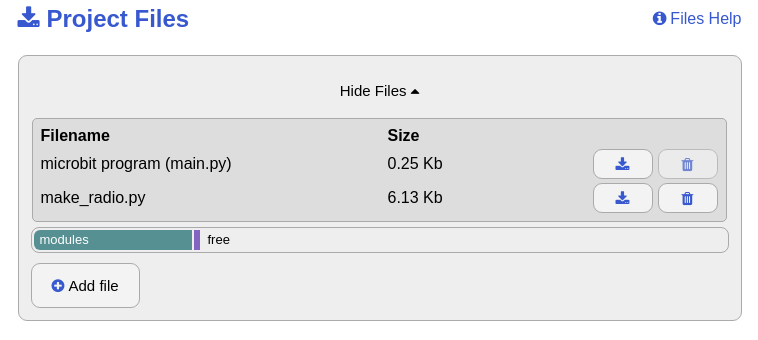

# Funklichtschalter

## Einleitung

Wenn ihr euch entscheidet, diese Übung mit Python zu realisieren, findet ihr die passende Einleitung unter in der unter [Funklichtschalter](../60_lightswitch/lesson).


## Verwendete Technologien

* Micro Python Online Editor
* Micro Python
* Funkschnittstelle


## Programmierung

In dieser Übung programmieren wir einen einfachen Funklichtschalter. Die LED-Anzeige ist dabei die Lampe. Die Taste A des micro:bit ist dabei der Lichtschalter für die entfernte Lampe und die Taste B soll als Schalter für die eigene Lampe dienen.

Mit dem Drücken des Schalters soll die Lampe eingeschaltet werden und eingeschaltet bleiben, ein erneuter Tastendruck schaltet die Lampe wieder ab.

Diese Übung führen wir in Zweiergruppen durch. Jede Gruppe wird von uns eine Gruppennummer erhalten. Dadurch stellen wir sicher, dass nur eure zwei micro:bits sich verstehen können und ihr so nicht die Tests der anderen Gruppe beeinflusst.

Wir können den micro:bit auch mit Python programmieren. Dazu schreiben wir das Programm in Textform und nicht mit graphischen Blöcken.

Damit unser micro:bit dasselbe Protokoll spricht wie mit der Makecode-Umgebung brauchen wir eine Bibliothek, welche ihm diese Fähigkeit beibringt. Zudem brauchen wir auch noch eine Bibliothek, welche die Grundfunktionen des micro:bit wie Taster und Anzeige  beinhaltet.

```python
from microbit import *
import make_radio
```

Damit das funktioniert, müssen wir nun der Entwicklungsumgebung noch die Datei ```make_radio.py``` zur Verfügung stellen.

Als erstes müssen wir die Datei runterladen: [Modul MakeRadio](./make_radio.py)


Danach öffnen wir mit dem Knopf **Load/Save** das folgende Menü.



Nach dem Klick auf **Show Files** können wir nun die Datei ```make_radio.py``` via **Add file** hinzufügen:



Danach sollte es so aussehen:



Zu Beginn initialisieren und starten wir die Funkschnittstelle. Stellt dabei die ```group``` auf die eurer Gruppe zugeteilte Ziffer. Danach schalten wir die Funkschnittstelle aus und wieder ein.

```python
radio = make_radio.MakeRadio(group=1)
radio.off()
radio.on()
```

Da wir unser Licht auf verschiedene Weise ein- und ausschalten wollen, speichern wir den Zustand des der Lampe in der Variable ```licht```, welche wir auf ```False``` initialisieren, damit die Lampe beim Aufstarten aus ist. Diese Variable ist eine sogenannte boolsche Variable, das heisst sie kann nur zwei Zustände einnehmen: ```False``` und ```True``` was auf deutsch soviel heisst wie Falsch respektive Wahr.

```python
licht = False
```

Zudem benötigen wir eine Bild, dass wir darstellen können, welches die ganze LED-Anzeige einschalten. Das Bild nennen wir ```Lampe``` und setzen jede der fünf LEDs in jeder der fünf Zeilen auf 9, das heisst volle Helligkeit:

```python
lampe = Image("99999:"
              "99999:"
              "99999:"
              "99999:"
              "99999")
```

Nun benötigen wir einen Abschnitt, der dauerhaft ausgeführt wird, wie ihr das von der Makecode-Umgebung kennt. Darin wollen wir als erstes einmal den Zustand der Lampe behandeln. Dazu fragen wir den Zustand der Variable ```licht``` ab. Dies erreichen wir mit folgenden Zeilen:

```python
while True:
    if licht:
        display.show(lampe)
    else:
        display.clear()
```

Wenn wir Taste A drücken, senden wir die Zahl 0 über Funk um die Lampe am anderen micro:bit zu schalten: 

```python
if button_a.was_pressed():
    radio.send_number(0)
```

Nun müssen wir noch auf die Funkmeldung des anderen micro:bit hören um die Lampe auf unserem micro:bit zu schalten. Wenn die Taste B gedrückt wird, müssen wir dasselbe tun.

Damit wir den Programmteil, der den Inhalt der Variable ```licht``` ändert nur einmal schreiben müssen, erstellen wir die Funktion ```schalte_licht```. Eine Funktion ist ein Programmteil, der immer wieder aufgerufen werden kann unter dem vergebenen Namen. Die Funktion ändert beim Aufruf den Inhalt von ```licht``` wenn er aktuell ```False``` ist nach ```True``` und umgekehrt und gibt ihn zurück.
```python
def schalte(licht):
    return not licht
```

Dies tun wir nun, wenn die Taste B gedrückt wird:

```python
if button_b.was_pressed():
    licht = schalte(licht)
```

Und auch wenn wir eine ```0``` über Funk empfangen.

```python
data = radio.receive_packet()
if data == 0:
    licht = schalte(licht)
```

Am Schluss des Abschnitts schlafen wir für 100 ms um etwas Energie zu sparen:

```python
sleep(100)
```


## Was haben wir gelernt

*   Nutzen der Funkschnittstelle
*   Erstellen von einfachen Funktionen

## Programme

*   [Modul MakeRadio](./make_radio.py)
*   [Funklichtschalter](./funklichtschalter.py)
