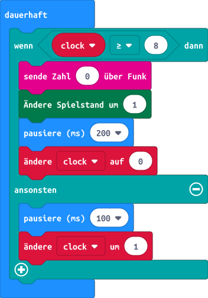

# Glühwürmchenschwarm

## Einleitung

Glühwürmchen oder Leuchtkäfer sind kleine Insekten welche in der Lage sind, Lichtsignale zur Kommunikation auszusenden. Einige Unterarten synchronisieren dabei ihr blinken, so dass beispielsweise alle Käfer am selben Busch im Gleichtakt blinken.

In der vorherigen Übung haben wir gesehen, wie die micro:bits per Funk miteinander kommunizieren können. Dies wollen wir nun ausnutzen, um blinkende micro:bits miteinander zu synchronisieren.

Doch wie synchronisieren sich Glühwürmchen? Es ist nicht etwa so, dass ein Glühwürmchen der Chef ist und den Takt vorgibt wie der Dirigent im Orchester. Man kann sich vorstellen, dass jedes Glühwürmchen eine innere Uhr hat und jedes mal wenn eine bestimmte Zeit vergangen ist, blinkt es. Sieht es ein benachbartes Glühwürmchen aufleuchten, so stellt es seine Uhr ein klein wenig nach vorne. Mit der Zeit blitzen dann alle gleichzeitig auf. Auf folgender [Webseite (englisch)](https://ncase.me/fireflies/) wird das ganze mit einer Animation erklärt. 

## Verwendete Technologien

* Makecode Online Editor
* Block Programmiersprache
* Funkschnittstelle


## Programmierung

Zwar hat unser micro:bit einen Helligkeitssensor, jedoch ist es nicht so einfach, damit ein aufleuchten eines anderen micro:bit zu detektieren. Also behelfen wir uns mit der Funkschnittstelle. Das heisst, jedes mal wenn unser micro:bit aufblitzt senden wir eine Nachricht per Funk an die anderen micro:bits. Jeder micro:bit der die Nachricht empfängt stellt dann seine Uhr ein klein wenig vor.

Beim Aufstarten müssen wir auch hier wieder die Funkgruppe setzen, damit sich die micro:bits gegenseitig hören können. Dieses mal allerdings wollen wir alle dieselbe Gruppe wählen. Zudem initialisieren wir eine Variable genannt ```clock``` und warten dann für eine zufällige Zeit zwischen 100 und 1000 Millisekunden (ms), bevor wir mit dem Programm weiterfahren. Dies tun wir, damit unsere Glühwürmchen am Anfange asynchron blinken, selbst wenn wir alle micro:bits gleichzeitig mit Strom versorgen:


Nun fügen wir in den Block **dauerhaft**, einen Entscheidungsblock aus dem Menü **Logik** ein. Wir wollen nun jedesmal aufblinken wenn die Uhr grösser oder gleich acht ist. Wir senden erst eine Nachricht per Funk an die anderen "Käfer". Das Aufblinken realisieren wir mit dem Block **ändere Spielstand um 1**. Das klingt erst einmal komisch, dies dient jedoch einfach nur dazu, eine Blinkanimation anzuzeigen. Anschliessend warten wir für 200 ms und setzen die Uhr auf 0.

Ist die Uhr kleiner als 8, so warten wir 100 ms und erhöhen die Uhr um 1.



Anschliessend nehmen wir den Block **wenn Datenpaket empfangen** unter Funk und erhöhen darin unsere Variable ```clock```:


Im Simulator sollte nun ein zweites micro:bit erscheinen, welches sich mit dem ersten synchronisiert. Falls das klappt, kannst du dein Programm auf das micro:bit laden sobald alle fertig sind, werden wir den ganzen Schwarm testen.

## Was haben wir gelernt

*   Nutzen der Funkschnittstelle


## Programme

*   [makecode::Glühwürmchen](https://makecode.microbit.org/_bUCRtz7gCF8r)