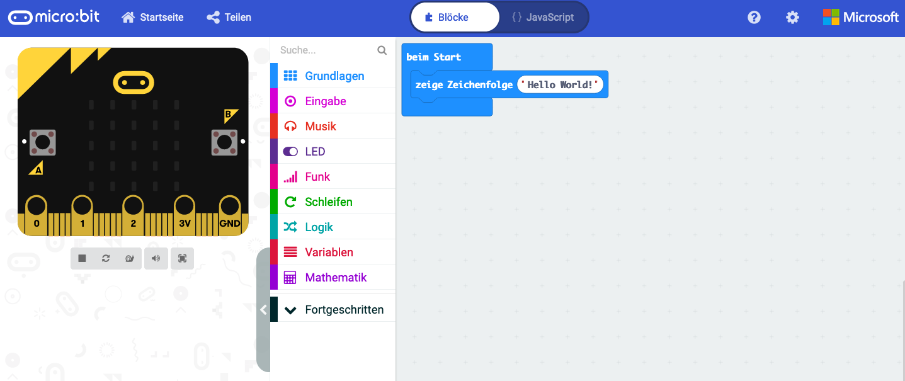
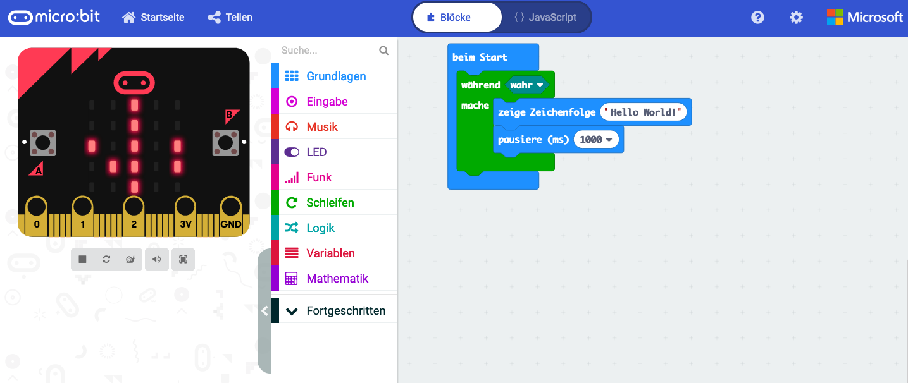

# Template Lesson

## Einleitung

In diesem Teil erstellen wir unser erstes Program im Block Editor von Makecode. Wir werden das Program im Browser starten und beobachten und wenn alles funktioniert auf den micro:bit laden.

*Gemeinsame Programmierung des Hello World Programs zur Einführung und Test Umgebung
Schritt für Schritt Anleitung mit Begleitung (wieviele Betreeuer?)*

Scroll Schrift mit eigenem Namen

## Verwendete Technologien

* Makecode Online Editor
* Block Programmiersprache
* Simulator und micro:bit

## Programmierung

### Schritt 1 - [makecode::hello world 1](https://makecode.microbit.org/_8MPCeJCkVXjW)

*   Aufruf Makecode Website https://makecode.microbit.org/#editor
*   Sprache auf Deutsch ändern: Zahnrad Symbol -> Language -> German
*   Neues Projekt.
*   **Zeige Zeichenfolge** aus Grundlagen holen. 
*   Block in **Beim Start** platzieren.
*   Text ändern auf "Hello World".
*   Block *dauerhaft* löschen, er wird nicht benötigt.

*   Simulator zeigen
*   Download auf Micro:bit zeigen

### Schritt 2 - [makecode::hello world 2](https://makecode.microbit.org/_AMCWUATzHHi8)

Umbau des Prohgrams so dass Text dauernd läuft

*   Endlosschleife hinzufügen
    * fdsjklfd
    * fdsjkl

## Was haben wir gelernt

*   Erstellen eines neues Programmes im Block Editor
*   Testen/ausprobieren des Programms im Simulator
*   Herunterladen und starten des Programs auf dem micro:bit
